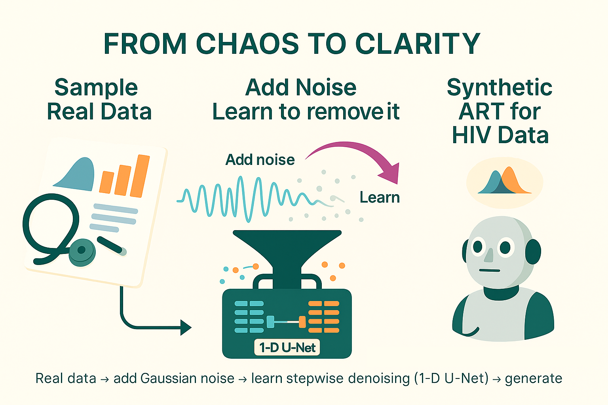
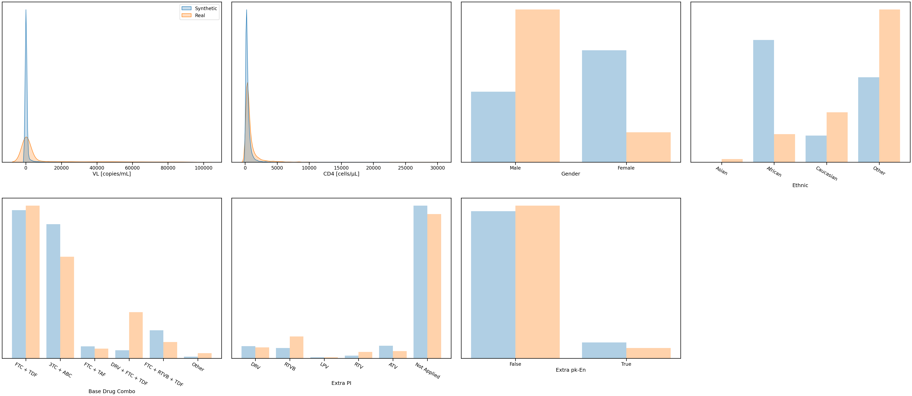

# ART for HIV using the Health Gym v3 Model (Diffusion)

Hey, hello, and Kia Ora!

In this walkthrough, we’ll explore the Health Gym v3 model -- our diffusion-based approach for generating realistic synthetic health data.

While all previous versions (v1, v2, v2.5) relied on GANs to adversarially learn data distributions, v3 learn by gradually adding and then removing noise, discovering how to reconstruct meaningful patterns from chaos.

---

## About this Example

As before, this notebook is a worked sample -- and yes, the code is included in the same folder as this blog.
It’s designed to show the overall workflow of Health Gym v3, so you can see how diffusion principles translate to clinical time series.

A few notes up front:

* The original paper describing this model can be found here: 
  [Kuo et al.  (2023), “Synthetic Health-related Longitudinal Data with Mixed-type Variables Generated using Diffusion Models.” NeurIPS Workshop on Synthetic Data Generation with Generative AI](https://openreview.net/forum?id=1MV49Ug6q9)
* The v3 model replaces all previous GAN-based training loops with a noise–denoise process driven by a 1-D U-Net backbone.
* This walkthrough stays high-level; detailed implementation (scheduler, UNet layers, and sampling loop) will be covered in the [Implementation Series](https://github.com/NicKuo-ResearchStuff/Health_Gym_AI/tree/main/Blogs).

---

## What This Workflow Does

At a glance, the main steps are:

1. Load the ART for HIV cohort.
2. Standardise categorical and numeric variables (as before).
3. Add and remove noise: the model learns to reconstruct data by corrupting inputs with Gaussian noise and progressively denoising them. For more insights, see [here](https://github.com/NicKuo-ResearchStuff/Health_Gym_AI/tree/main/Blogs/Blogs_Z_Implementation/Implementation19).
4. Train the generative model: start from noised examples and teach a 1-D CNN-based U-Net to predict and remove noise step by step -- learning to create meaningful patient trajectories.
5. Generate synthetic data: begin from pure noise, iteratively denoise to produce coherent sequences.
6. Evaluate realism: compare distributions, correlations, and subgroup coverage against the real cohort.

---

## Results

After 3000 epochs

  

We can see that the diffusion model performs noticeably better than the earlier GAN-based versions when reconstructing data with strong class imbalance.
I’m not entirely sure what happened with the generation of the sex variable for the synthetic patients -- something to look into!  
Nonetheless, this is only a worked example, so feel free to experiment with it yourself. The model’s performance can be further improved by tweaking the hyperparameters and adjusting the training schedule.

---

### Takeaway

Health Gym v3 represents a major shift from adversarial to diffusion-based generation.
It differs from v1, v2, and v2.5 on many levels:

* Training principle: GANs learn through competition; diffusion models learn through reconstruction.
* Training dynamics: diffusion models are fast and stable to train, without mode collapse.
* Architectural needs: instead of recurrent or transformer backbones, v3 relies on a U-Net with 1-D CNNs to model noise removal across timesteps.
* Trade-offs: training is efficient, but sampling is slower -- because each synthetic record is generated through a step-by-step denoising loop.
* Overall: diffusion brings reliability and smooth convergence, but typically requires more epochs to reach full fidelity.

---

## What’s Next

This walkthrough only scratches the surface.
In the upcoming Implementation Blogs, we’ll unpack the diffusion process in detail — from noise schedules and denoising objectives to how the 1-D U-Net operates under the hood.

Cheers, 
\- Nic

(Last Edit: 2025-10-23)
