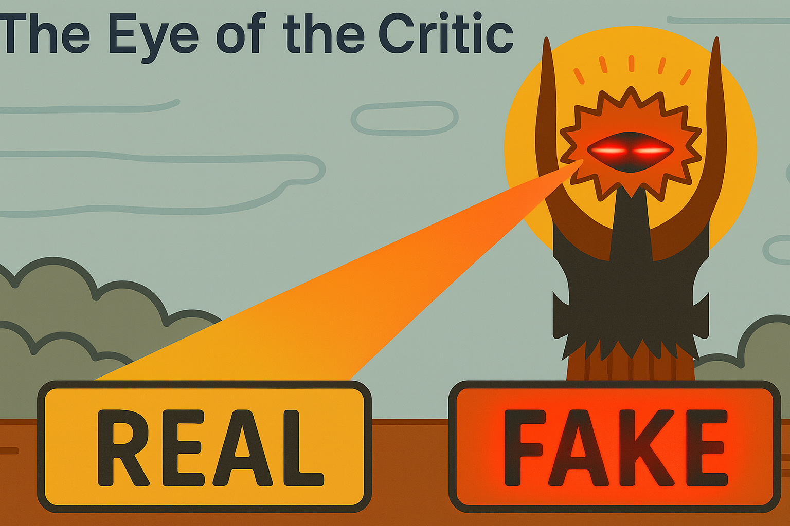

# Health Gym v1: The Eye of the Critic, Part 2



Hey, hello, and Kia Ora!

In [Part 1](https://github.com/NicKuo-ResearchStuff/Health_Gym_AI/tree/main/Blogs/Blogs_Z_Implementation/Implementation08), we focused on how the critic scores real (A), fake (B), and generator-step fakes (E). This follow-up zooms in on the two remaining roles that make WGAN-GP stable in practice:

* (C) scoring interpolated sequences, and
* (D) taking gradients w.r.t. those inputs to enforce the 1-Lipschitz constraint via the gradient penalty.

---

## The two extra calls the critic must handle

Here’s the small slice of pseudocode we care about:

```text
# Draw a fresh fake batch to pair with this real batch
Z        ← SAMPLE_LATENT(B, L)
X_fake   ← G(Z)

# (C) Interpolate between real and fake
α        ← Uniform(0, 1) of shape [B,1,1]
X_interp ← α * X_real + (1-α) * X_fake

# (C) Score the interpolated samples
D_interp ← D(X_interp)

# (D) Take gradient of critic output wrt inputs
g        ← ∂ D_interp / ∂ X_interp          # shape [B, L, F] → flattened per sample
gp       ← GP_λ * mean( (||g||_2 − 1)^2 )

# Critic loss (Wasserstein + GP)
L_D      ← mean(D_fake) − mean(D_real) + gp
```

### (C) Why interpolate at all?

Weight-clipping (the original WGAN trick) often harms capacity. WGAN-GP instead enforces the 1-Lipschitz property along straight lines between real and fake samples. Concretely:

* We draw α ~ U(0,1) and build X_interp = α·X_real + (1−α)·X_fake.
* Note X_interp keeps the same [B, L, F] shape -- we preserve the sequence (L) and feature (F) axes, not just individual rows.

The critic sees these "in-between" sequences and returns D(X_interp) exactly like it does for real or fake.

### (D) Why differentiate w.r.t. the inputs?

The gradient g = ∂D/∂X_interp measures how steep the critic’s surface is in input space.
WGAN-GP penalises (||g||₂ − 1)², encouraging the critic’s slope to stay near 1 where it matters (on the data manifold and the lines joining it to the generator’s manifold). This is the heart of the 1-Lipschitz constraint, and the main reason training is far more stable than with vanilla GANs.

---

## Where this lives in the code

The implementation does this inside `Execute_D004._gradient_penalty`:

```python
def _gradient_penalty(self, data_real, data_fake):
    B = self.batch_size
    alpha = torch.rand((B, 1, 1), device=data_real.device).expand_as(data_real)
    interpolated = alpha * data_real + (1 - alpha) * data_fake
    interpolated.requires_grad_(True)

    out = self.D(interpolated)  # (C)

    grad = autograd.grad(       # (D)
        outputs=out,
        inputs=interpolated,
        grad_outputs=torch.ones_like(out),
        create_graph=True,
        retain_graph=True,
    )[0]

    grad = grad.view(B, -1)     # flatten [L, F] per sample
    norm = torch.sqrt((grad  2).sum(dim=1) + 1e-12)
    return self.gp_weight * ((norm - 1)  2).mean()
```

And the critic loss we compute uses it as:

```python
L_D = D_fake.mean() - D_real.mean() + gradient_penalty
```

to stabilise training through local smoothness.

---

## Wrapping up

In Part 2 we covered the critic’s two remaining roles:

* (C) scoring interpolated sequences, and
* (D) supplying input-space gradients to build the gradient penalty.

In the next blog, we will start covering the generator.

Cheers,</br>
\- Nic

(Last Edit: 2025-10-03)
