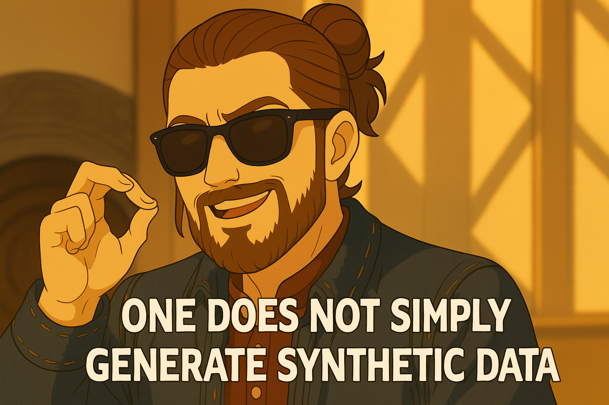

# Health Gym v1: One Does Not Simply Create Synthetic Data, Part 1

  

Hey, hello, and Kia Ora!

In the last two blogs (see: [08](https://github.com/NicKuo-ResearchStuff/Health_Gym_AI/tree/main/Blogs/Blogs_Z_Implementation/Implementation08) and [09](https://github.com/NicKuo-ResearchStuff/Health_Gym_AI/tree/main/Blogs/Blogs_Z_Implementation/Implementation09)), we looked at how the WGAN-GP critic judges realism in sequences of synthetic patient data.
This time we turn our attention to its creative rival: the Generator, the model that transforms pure noise into plausible longitudinal clinical trajectories.

---

## The Generator’s Place in the Training Loop

Here’s the same simplified pseudocode:

```text
for epoch in 1..Epochs:
    for L in sorted(keys(Loaders)):        # curriculum over sequence length
        for each batch (X_real, lengths) in Loaders[L]:
            X_real ← X_real.to(device)

            # --- Critic update(s): generator supplies fakes ---
            repeat G_iter times:
                Z      ← SAMPLE_LATENT(num_samples=B, seq_len=L)
                (A) X_fake ← G(Z)            # generator creates fake sequences
                D_real ← D(X_real)
                D_fake ← D(X_fake)
                update critic with L_D = mean(D_fake) - mean(D_real) + gp

            # --- Generator update: we’ll cover this in the next post ---
            Z      ← SAMPLE_LATENT(BatchSize, L)
            X_fake ← G(Z)
            D_fake ← D(X_fake)
            update generator with L_G = -mean(D_fake) + Corr_λ * L_corr
```
---

## (A) Providing Fakes for Critic Training

Notice how the generator already plays an essential role before it’s even trained — it must supply the critic with fake data of believable shape and structure.

When the critic trains, it needs both real and fake sequences to measure a gap between the two.
That’s where the generator comes in.

```python
def _critic_train_iteration(self, data_real):
    data_fake = self.generate_data(data_real.shape[1], data_real.shape[0])  # (A)
    D_real = self.D(data_real)
    D_fake = self.D(data_fake)
    ...
```

Here, `generate_data()` draws latent noise tensors
(Z ∈ ℝ^{B×L×I}) (batch × sequence × latent_dim),
feeds them into the generator, and emits fake sequences
(X_fake ∈ ℝ^{B×L×F}).

---

## (B) Inside the Generator

Now, what exactly happens inside `G(z)` when we ask the generator to produce those fakes?
Let’s look at the design of the forward pass.

### Step 1 — Bidirectional sequence encoding

Two custom LSTMs (`MyLSTM`) read the latent sequence forward and backward:

* `rnn_f(Z)` captures forward dynamics;
* `rnn_r(Z[::-1])` captures backward context.

Their hidden states are concatenated so that each timestep sees both past and future context.

### Step 2 — Feature mixing with MLP

The biLSTM outputs are passed through two fully-connected layers with `LeakyReLU` activations:

```
Linear → LeakyReLU → Linear → LeakyReLU
```

This blends temporal information into feature-wise logits.

### Step 3 — Block-wise output heads

A final `Linear` projects to the full feature, as defined by the [dataset schema](https://github.com/NicKuo-ResearchStuff/Health_Gym_AI/tree/main/Blogs/Blogs_Z_Implementation/Implementation05).
Then, activation functions are applied per block to ensure each variable obeys its type and range:

* Real-valued blocks (like VL, CD4) → `sigmoid` → values in [0, 1] (matching the Box–Cox + min–max preprocessing).
* Categorical/binary blocks → `softmax` over their one-hot spans → valid probability vectors.

Conceptually:

```
Z (noise) ──▶ biLSTM (fwd/bwd) ─▶ MLP ─▶ Linear(F)
       ├─ reals slice → sigmoid  → [0,1]
       └─ cats slice  → softmax  → per-block simplex
```

Or in pseudocode:

```text
function G.forward(Z: [B,L,I]):
    H_f = LSTM_fwd(Z)
    H_r = LSTM_bwd(reverse(Z))
    H   = concat(H_f, H_r)
    U   = LeakyReLU(Linear1(H))
    V   = LeakyReLU(Linear2(U))
    W   = Linear3(V)                 # [B,L,F] raw logits

    Y_real = sigmoid(W[..., 0:max_real])
    Y_cats = []
    for each categorical block [s:e):
        Y_cats.append(softmax(W[..., s:e], dim=-1))
    return concat(Y_real, *Y_cats)
```

This approach helps the generator to understand the shape of the data manifold it’s supposed to live on, rather than just producing free-floating numbers.

---

## Wrapping up

In this first half of the story, the generator serves two purposes:

* (A) It provides the critic with a steady stream of fakes during critic updates.
* (B) It builds those fakes correctly, respecting numerical ranges and categorical structure through its biLSTM + MLP + blockwise activation pipeline.

In the next post, we’ll follow the generator into its third role — how it listens to the critic’s judgment and learns to improve itself through the adversarial loss ( − E[D(fake)] ).

Cheers,</br>
\- Nic

(Last Edit: 2025-10-06)
