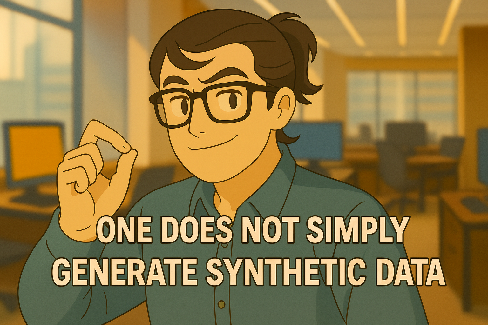

# Health Gym v1: One Does Not Simply Create Synthetic Data, Part 2

  

Hey, hello, and Kia Ora!

In [Part 1](https://github.com/NicKuo-ResearchStuff/Health_Gym_AI/tree/main/Blogs/Blogs_Z_Implementation/Implementation10), we explored how the generator builds schema-true synthetic sequences and supplies the critic with fakes during its updates.
In this follow-up, we’ll trace what happens when the generator itself steps up to learn -- how it listens to the critic’s verdict and reshapes its own output distribution.

---

## The Generator’s Turn in the Training Loop

Here’s the pseudocode fragment we care about now:

```text
# After critic updates
Z      ← SAMPLE_LATENT(BatchSize, L)
X_fake ← G(Z)
(C) D_fake ← D(X_fake)                # critic scores frozen
L_G ← -mean(D_fake) + Corr_λ * L_corr
update generator with L_G
```

Up to this point, the critic has already been trained for `G_iter` rounds on real and fake sequences.
Now, the critic is frozen to just scores the new fake data; and the generator uses those scores to move its samples toward regions the critic deems realistic.

---

## (C) Learning from the Critic’s Judgment

Let’s unpack `_generator_train_iteration()`:

```python
def _generator_train_iteration(self, seq_len):
    data_fake = self.generate_data(seq_len)
    D_fake    = self.D(data_fake)       # (C)
    corr_loss = self._correlation_loss(data_fake)
    self.G_opt.zero_grad()
    G_loss = -D_fake.mean() + self.c_weight * corr_loss
    G_loss.backward()
    self.G_opt.step()
    return G_loss.item(), corr_loss.item()
```

### Step 1 — Generate candidates

A fresh batch of latent tensors `Z ∈ ℝ^{B×L×I}` is sampled.
The generator produces candidate sequences `X_fake ∈ ℝ^{B×L×F}` at the current curriculum length `L`.

### Step 2 — Critic evaluation

The critic (frozen) provides scalar realism scores `D_fake`.
Higher scores ⇒ more "real-like".
The generator wants to raise these scores E[D(fake)].

---

### Summary 
* Wasserstein feedback: gives smooth gradients -- the generator learns how far off it is, not just "real / fake".
* Curriculum over L: lets the generator first master short-term consistency before tackling full-length patient trajectories.

This allow Health Gym’s generator evolve from chaotic noise into synthetic cohorts that maintain both plausibility and structure.

---

## Wrapping Up

This completes the generator’s tri-factor roles:
* (A) providing fakes for critic training,
* (B) constructing schema-true sequences, and
* (C) learning from the critic’s judgment.

In the next post, we’ll zoom out and discuss the interplay between the critic and the generator.

Cheers,</br>
\- Nic

(Last Edit: 2025-10-06)
