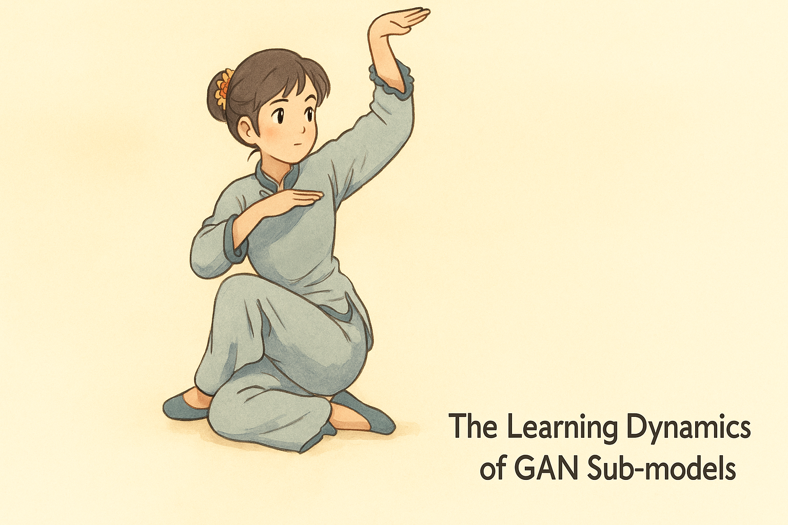
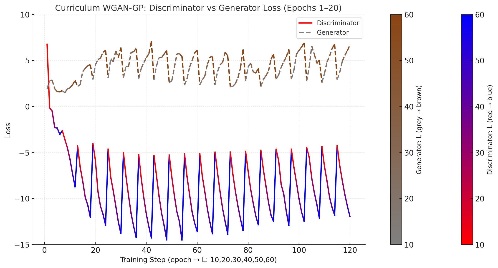
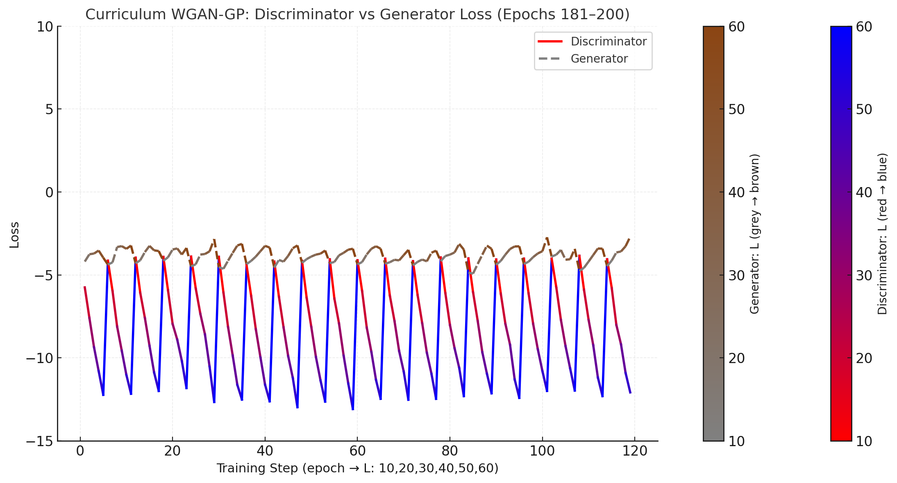

# Health Gym v1: The Learning Dynamics of GAN Sub-models

  

Hey, hello, and Kia Ora!

In the last few posts, we explored the two halves of the Health Gym v1 WGAN-GP model:

* the critic, our judge of realism (see: blogs [08](https://github.com/NicKuo-ResearchStuff/Health_Gym_AI/tree/main/Blogs/Blogs_Z_Implementation/Implementation08) \& [09](https://github.com/NicKuo-ResearchStuff/Health_Gym_AI/tree/main/Blogs/Blogs_Z_Implementation/Implementation09)), and  
* the generator, our composer of synthetic clinical sequences (see: blogs [10](https://github.com/NicKuo-ResearchStuff/Health_Gym_AI/tree/main/Blogs/Blogs_Z_Implementation/Implementation10) \& [11](https://github.com/NicKuo-ResearchStuff/Health_Gym_AI/tree/main/Blogs/Blogs_Z_Implementation/Implementation11)).  

Now, we zoom out to see how the two perform together, under the adversarial training process.

---

## The Setup

At the heart of the training script (see `Execute_D004.train()` in the [worked example](https://github.com/NicKuo-ResearchStuff/Health_Gym_AI/blob/main/Blogs/Blogs003_HandsOn(HealthGymV1)/2025_09_23_WganGp_Example.ipynb)) is this loop:

```python
for Cur_Len in All_Length:
    for batch_idx, (data_real, _) in enumerate(Cur_loader):
        data_real = data_real.cuda()
        for _ in range(self.G_iter):
            D_Loss, GP, D_real_mean, D_fake_mean = self._critic_train_iteration(data_real)
        G_Loss, Corr_Loss = self._generator_train_iteration(seq_len=Cur_Len)

        print(f"[Epoch {self.PreviousEpoch + epoch + 1}] "
              f"L={Cur_Len} step {batch_idx + 1}/{len(Cur_loader)} | "
              f"D_loss={D_Loss:.4f} GP={GP:.4f} "
              f"D_real={D_real_mean:.4f} D_fake={D_fake_mean:.4f} | "
              f"G_loss={G_Loss:.4f} Corr={Corr_Loss:.4f}")
````

Each print line records the performance of the two sub-models.

| Symbol              | Mathematical Role                                           | What It Tells Us                                           |
| :------------------ | :---------------------------------------------------------- | :--------------------------------------------------------- |
| D_loss          | $\mathcal{L}_D$                                             | critic’s total objective (lower = smoother, more balanced) |
| GP              | gradient-penalty term                                       | should hover near λ = 10                                   |
| D_real / D_fake | expectations $\mathbb{E}[D(x)]$, $\mathbb{E}[D(\tilde{x})]$ | their gap ≈ Wasserstein distance                           |
| G_loss          | $\mathcal{L}_G$                                             | how much the generator still struggles to fool the critic  |
| Corr_Loss       | correlation term                                            | smaller → synthetic and real structures align              |

Training across increasing sequence lengths (10 → 20 → … → 60) (see [curriculum learning](https://github.com/NicKuo-ResearchStuff/Health_Gym_AI/tree/main/Blogs/Blogs_Z_Implementation/Implementation06)) lets both networks model short sequences before tackling full-length patient trajectories.

---

## Results





The top plot shows the results over epochs 1-20, and the bottom shows the results over epochs 181-200. By these plots, we can claim that training  became more successful over time.

We observe that:

* Wasserstein gap narrows: Early on, the critic loss reached about −14 at its per-L minima.
  By epochs 181–200 it stabilized around −8 to −10 with a tighter spread.
  In WGAN-GP, as $p_G$ approaches $p_r$, the expected score difference shrinks, making $\mathcal{L}_D$ less negative → closer distributions.
* Generator stabilises: Early, $\mathcal{L}_G$ oscillated widely; later it flattened near a steady band with smaller amplitude -- meaning the generator consistently finds useful gradients.
* Oscillation amplitude drops: The curriculum-driven saw-tooth pattern (10→60) remains but is more regular -- an indicator of healthy adversarial balance rather than instability.
* No divergence: Neither loss drifts or explodes -- no sign of critic overfitting or mode collapse.
* Length generalisation: Longer sequences once perturbed losses strongly; by late epochs the differences per L are mild, implying the generator handles full trajectories smoothly.

---

## Wrapping Up

While the loss curves already show equilibrium emerging, final confirmation still requires looking at the data itself.
The next step is to plot the distributions of real vs synthetic clinical variables (*e.g.,* CD4, VL, drug exposure) and perform some honest eyeballing -- checking shape, spread, and realistic variability.

That will be the focus of the next blog, where we visualise how closely Health Gym v1’s generated patients resemble their real-world counterparts.

---

Cheers,</br>
\- Nic

(Last Edit: 2025-10-08)
