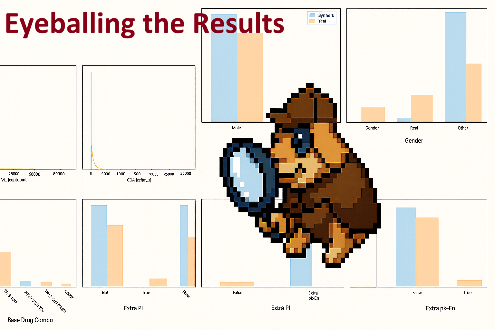
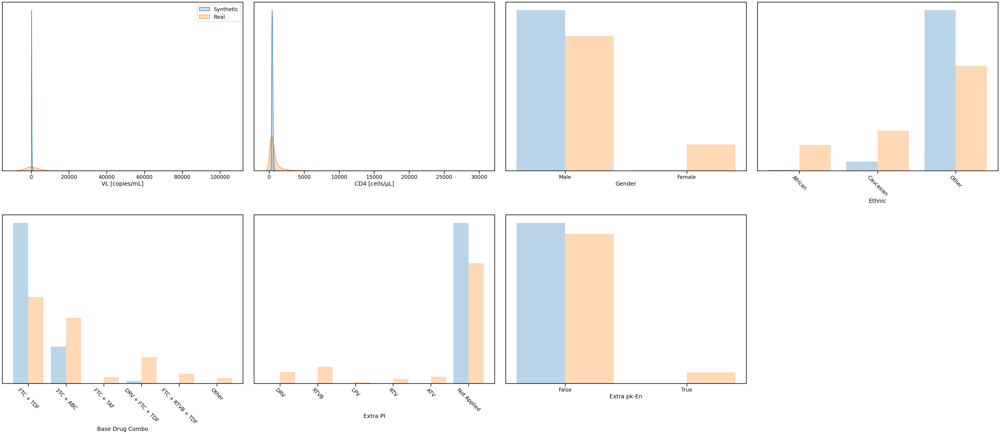

# Health Gym v1: Eyeballing the Results

  

Hey, hello, and Kia Ora!

In the [last post](https://github.com/NicKuo-ResearchStuff/Health_Gym_AI/tree/main/Blogs/Blogs_Z_Implementation/Implementation12), we investigated the learning dynamics of the losses of the critic and generator; this time, let's move from numbers to sight.

Let's compare the synthetic data side-by-side with the real ones, to see whether WGAN-GP is genuinely learning realism.

---

## The Setup

After training with (in [here](https://github.com/NicKuo-ResearchStuff/Health_Gym_AI/blob/main/Blogs/Blogs003_HandsOn(HealthGymV1)/2025_09_23_WganGp_Example.ipynb)):

```python
wgan_gp.train(only10_60)
```

We
* Generate synthetic sequences of length 60,
* Decode them back to human-readable features (*e.g.,* CD4, VL, Drug Combo), and
* Overlay their distributions against the real dataset.

Below is the complete visualisation workflow of the ``data decoding pipeline'':

```
Generated (Synthetic) sequences ─┐
                                 ├─▶ collect_loader_sequences() → sample_and_flatten()
Real (Reference) sequences ──────┘
                                       │
                                       ├─▶ Execute_C007(...):
                                       │      - _inv_boxcox_torch() for numeric inverse Box–Cox
                                       │      - argmax over one-hot for categorical/binary
                                       │
                                       └─▶ Build tidy tables:
                                              - to_cpu() → NumPy
                                              - Execute_C008() → nice axis labels
                                              - make_df() → feature-wise DataFrame
                                              - set_categorical_with_order() for ordered bars
                                                 │
                                                 ├─▶ For numeric vars → KDE plots (VL, CD4)
                                                 │        (seaborn.kdeplot on make_df output)
                                                 │
                                                 ├─▶ For categorical vars → Histogram plots
                                                 │        (seaborn.histplot on make_df output)
                                                 │
                                                 └─▶ Overlay Real vs Synthetic distributions
                                                           │
                                                           └─▶ Visual realism evaluation
```

---

## The Output

  

* For numeric features like VL [copies/mL] and CD4 [cells/μL], smooth KDE curves show how synthetic distributions align (or drift) from the real ones.
* For categorical and binary features (*e.g.,* Drug Combo, Ethnic, Extra PI), side-by-side histograms show the degree of class balance preservation.

When training is healthy, the blue (synthetic) and red (real) shapes overlap substantially.

---

## Wrapping Up

As we’ve seen in this post, the results of Health Gym v1 after 100 epochs aren’t yet stellar -- but that’s perfectly fine. This version serves as a sandbox to explore how training dynamics behave and where improvements can be made.

In the next posts, we’ll explore:

* Continuing training: how to load saved weights and fine-tune an existing model for smoother convergence; and
* Advancing the architecture: how [Health Gym v2](https://github.com/NicKuo-ResearchStuff/Health_Gym_AI/tree/main/Blogs/Blogs004_HandsOn(HealthGymV2)) improves upon v1 by redesigning the generator for greater stability and realism.

Cheers,</br>
\- Nic

(Last Edit: 2025-10-13)

