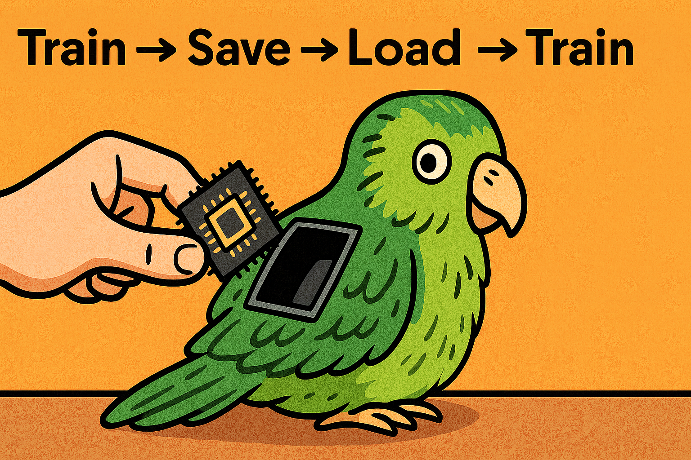

# Health Gym v1: Train -> Save -> Load -> Train



Hey, hello, and Kia Ora!

In the last post, we eyeballed realism by overlaying real vs synthetic distributions. If the results are not ideal, you might want to</br> 
train -> save -> load -> and then continually training</br>
the weights of the model.

This also makes life a bit easier:
* Long runs in chunks: train to epoch 100 today, continue to 200 tomorrow.
* Fine-tune: load a good checkpoint and tweak hyper-parameters (*e.g.,* correlation weight, learning rate).
* Crash safety: restart from the last saved state instead of from scratch.

---

## The Two Recipes

### 1) Fresh pre-train (no load)

```python
seed_all()

# Target *final* epoch for this run
Hyper002_Epochs = 100

# No loading this time
Hyper010_Continue = False
Hyper011_G_SD = "YDZ002_G_StateDict_Epoch0"   # placeholders, ignored
Hyper012_D_SD = "YDZ002_D_StateDict_Epoch0"
Hyper013_PreEpoch = 0

wgan_gp = Execute_D004(
    Hyper001_BatchSize, Hyper002_Epochs,
    Hyper003_G_iter, Hyper004_GP_Lambda, Hyper005_C_Lambda,
    Hyper006_ID, Hyper007_HD,
    Hyper008_LR, Hyper009_Betas,
    dtype, correlation_real,
    [Hyper010_Continue, Hyper011_G_SD, Hyper012_D_SD, Hyper013_PreEpoch]
)

wgan_gp.train(only10_60)
```

To use in your first training run for a clean baseline.

---

### 2) Load & continue (resume / fine-tune)

```python
# After the first run finishes at E0=100:
torch.save(wgan_gp.G.state_dict(), "YDZ002_G_StateDict_Epoch100")
torch.save(wgan_gp.D.state_dict(), "YDZ002_D_StateDict_Epoch100")

# Later, resume to a higher *final* epoch (e.g., 200)
seed_all()

Hyper002_Epochs   = 200      # final/global epoch you want to reach
Hyper010_Continue = True     # turn on checkpoint loading
Hyper011_G_SD     = "YDZ002_G_StateDict_Epoch100"
Hyper012_D_SD     = "YDZ002_D_StateDict_Epoch100"
Hyper013_PreEpoch = 100      # last finished epoch in the previous run

wgan_gp = Execute_D004(
    Hyper001_BatchSize, Hyper002_Epochs,
    Hyper003_G_iter, Hyper004_GP_Lambda, Hyper005_C_Lambda,
    Hyper006_ID, Hyper007_HD,
    Hyper008_LR, Hyper009_Betas,
    dtype, correlation_real,
    [Hyper010_Continue, Hyper011_G_SD, Hyper012_D_SD, Hyper013_PreEpoch]
)

wgan_gp.train(only10_60)     # trains epochs 101…200
```

To use for your extended training (100→200), with fine-tuning with small hyper-parameter changes.

---

## Under the Hood

1. `LoadPreTrain(content=[flag, G_path, D_path, prev_epoch])`

   * If `flag` is True, `torch.load` the state_dicts for G and D and return them.
   * If False, return `(0, 0)` as a sentinel (no checkpoint).

2. `Execute_D004.__init__(..., continue_info=...)`

   * Always builds fresh `self.G` and `self.D` (moved to CUDA if available).
   * Calls `LoadPreTrain(...)`; when weights are returned:

     ```python
     self.G.load_state_dict(G_SD)
     self.D.load_state_dict(D_SD)
     self.PreviousEpoch = continue_info[3]  # e.g., 100
     ```

     otherwise `self.PreviousEpoch = 0`.
   * Creates fresh Adam optimisers (note: optimizer state is not restored in this version).

3. `train(...)`

   * Loops `for epoch in range(self.epochs - self.PreviousEpoch)` and prints global epoch numbers as
     `self.PreviousEpoch + epoch + 1`, so logs continue at 101, 102, … when resuming from 100.

---

## Together...

```
Raw ART-for-HIV data ──▶ preprocess/design matrix ──▶ curriculum loaders (L=10…60)
                                  │
                                  └─▶ correlation_real (pooled from L=60)

                           ┌────────────────────────────────────────────────────┐
                           │  PRETRAIN (from scratch)                           │
                           │  continue_info = [False, 'G_SD', 'D_SD', 0]        │
Generated noise z ──────▶  │  wgan = Execute_D004(..., continue_info)          │
(Seq len L; batch B)       │  wgan.train(only10_60)   # epochs: 1…E₀            │
                           └───────────────┬────────────────────────────────────┘
                                           │
                                           ├─▶ SAVE at E₀
                                           │     torch.save(G.state_dict(), f"G_E{E0}")
                                           │     torch.save(D.state_dict(), f"D_E{E0}")
                                           │
                                           ▼
                           ┌────────────────────────────────────────────────────┐
                           │  RESUME / FINE-TUNE                                │
                           │  Hyper002_Epochs = E_target                        │
                           │  continue_info  = [True, 'G_E{E0}', 'D_E{E0}', E0] │
                           │  wgan = Execute_D004(..., continue_info)           │
                           │  train → runs (E_target - E0) epochs, prints       │
                           │          global epochs E0+1 … E_target             │
                           └────────────────────────────────────────────────────┘
```

---

## Wrapping Up

This pattern keeps your Health Gym v1 (WGAN-GP) training reproducible, chunkable, and easy to fine-tune—so you can push beyond the initial 100 epochs and steadily close the realism gap.

We will move on to Health Gym v2 in the next blog!

Cheers,</br>
\- Nic

(Last Edit: 2025-10-14)
