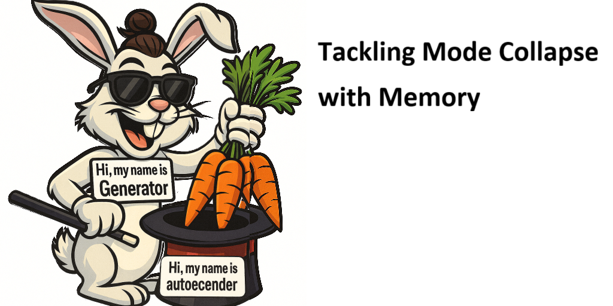
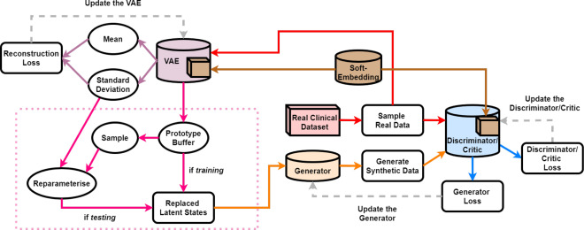

# Health Gym v2: Tackling Mode Collapse with Memory



Hey, hello, and Kia Ora!

Welcome to Health Gym v2 -- the next step in our journey from simple generative realism toward stability, diversity, and clinical fidelity.

In our [Scientific Data (2022)](https://www.nature.com/articles/s41597-022-01784-7) paper, we showed how a WGAN-GP can learn realistic synthetic patient trajectories.
Now, based on our [JBI (2023)](https://www.sciencedirect.com/science/article/pii/S1532046423001570) paper, we extend that design by adding a VAE and an external latent buffer to address mode collapse.

This extension :
* yields more realistic data distributions,
* better captures class-imbalanced combinations of clinical variables, and
* preserves model utility across downstream analyses.

---

## The Big Picture



The figure above (from our publication) shows how the new VAE module works alongside the existing WGAN pipeline.
* The autoencoder learns a structured latent representation from real data through the critic’s "soft-embedding" space.
* These encoded latent vectors are collected into a prototype buffer -- effectively a running memory of the real data manifold.
* During generation, the latent noise for the GAN’s generator is no longer purely random. Instead, it’s reparameterised:
  `z' = z * T_SD + Mean_sampled_from_buffer`,
  ensuring that generated sequences reflect the true diversity of patient patterns.

---

## The Updated Training Logic

Here’s how the updated `train()` function works in v2 (see [here](https://github.com/NicKuo-ResearchStuff/Health_Gym_AI/blob/main/Blogs/Blogs004_HandsOn(HealthGymV2)/2025_09_24_WganGp%2BVAE%2BBuffer_Example.ipynb)).

1. Autoencoder Step

   * For every batch, we first update the `MyAE`:

     ```python
     AE_loss, T_SD = self.A(data_real, self.D)
     ```

     It reconstructs critic-embedded features, enforcing:

     ```
     AE_loss = MSE(reconstruction) + KLD(latent || N(0, I))
     ```

     The latent mean and std are then stored in `Mean_Container` and `T_SD`.

2. Noise Reparameterisation

   * When generating data, we sample from the stored latent means:

     ```python
     z = torch.rand(...); 
     z = z * self.T_SD + self.A.Mean_Container[sample_idx]
     data_fake = self.G(z)
     ```

3. Checkpointing

   * Now includes the autoencoder’s state and latent buffer:

     ```python
     torch.save(A.state_dict(), f"A_E{E0}")
     torch.save(A.Mean_Container, f"A_MC_E{E0}")
     ```

Resulting in

```
Raw ART-for-HIV data ──▶ preprocess/design matrix ──▶ curriculum loaders (L=10…60)
                                  │
                                  ├──────────────▶ correlation_real (pooled from L=60)
                                  │
                                  └──────────────▶ [NEW v2] AE input space = critic’s soft-embedded features

                           ┌───────────────────────────────────────────────────────────────────────────┐
                           │  (build G, D, [NEW] A; init A.Mean_Container, T_SD)                       │
                           │                                                                           │
[NEW v2] AE step each batch:  data_real ──▶ A(x | D) ──▶ AE_loss = MSE + KL                           │
                           │                                    │                                      │
                           │                                    └──▶ update T_SD, A.Mean_Container    │
                           │                                                                           │
Base noise  z ~ U(0,1) ───▶ [NEW v2] z' = z * T_SD + sample(A.Mean_Container) ─▶ G(z')                │
(Seq len L; batch B)       │                                                                           │              
                           │  Critic: WGAN-GP (real vs fake, interp + GP)                              │
                           │  Generator: -E[D(fake)] + λ_C · ||Corr(fake)-Corr(real)||₁                │  
                           │  wgan.train(only10_60)   # epochs: 1…E₀                                   │
                           └───────────────────────────────────────────────────────────────────────────┘
                                                       │
                                                       ├─▶ SAVE
                                                             torch.save(G.state_dict(), f"G_E{E0}")
                                                             torch.save(D.state_dict(), f"D_E{E0}")
                                                             torch.save(A.state_dict(), f"A_E{E0}")
                                                             torch.save(A.Mean_Container, f"A_MC_E{E0}")

```

---


## Wrapping Up

Health Gym v2 blends the strengths of autoencoders (structure and regularisation) with adversarial training (realism and fidelity).
By learning a latent memory from real data, the model now generates synthetic patient trajectories that are both realistic and diverse, even for rare treatments and demographic groups.

Starting from the next blog, we will go through the details behind some of the v2 mechanisms.

Cheers,</br>
\- Nic

(Last Edit: 2025-10-15)
