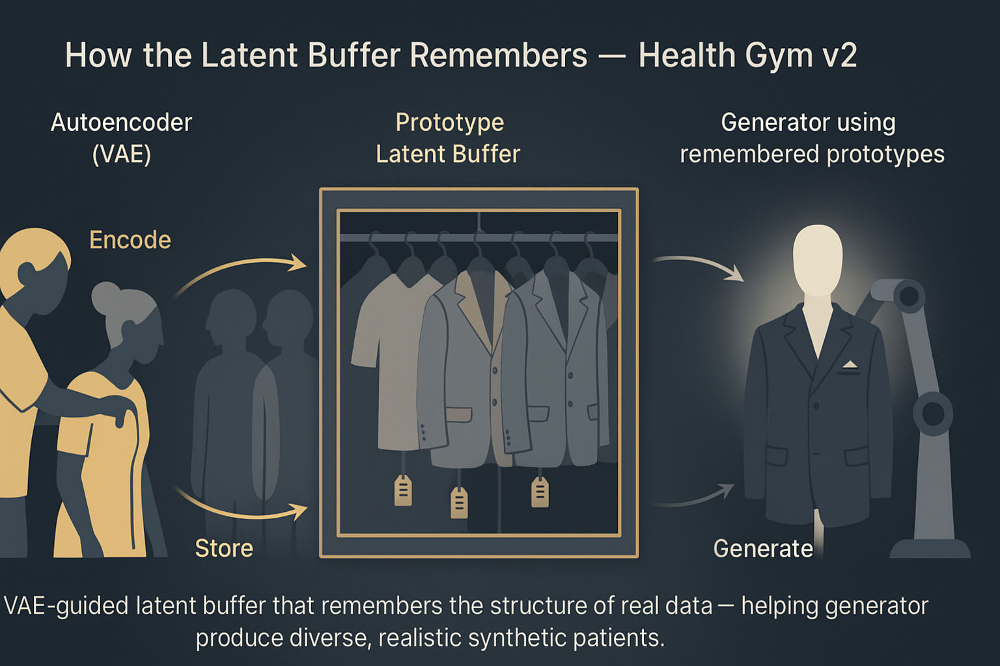

# Health Gym v2: How the Latent Buffer Remembers



Hey, hello, and Kia Ora!

In the [last blog](https://github.com/NicKuo-ResearchStuff/Health_Gym_AI/tree/main/Blogs/Blogs_Z_Implementation/Implementation15), we introduced Health Gym v2, where a VAE-guided latent buffer helps the generator escape mode collapse and capture richer patient diversity.
Today, we’ll look under the hood of that buffer -- how it grows, updates, and preserves memory across training runs.

---

## From Autoencoder to Memory

In the [source code](https://github.com/NicKuo-ResearchStuff/Health_Gym_AI/blob/main/Blogs/Blogs004_HandsOn(HealthGymV2)/2025_09_24_WganGp%2BVAE%2BBuffer_Example.ipynb), every batch that passes through the autoencoder (`MyAE`) leaves behind a prototype latent mean representing the current patients, and a latent scale for stability.

Find in code: `class MyAE(nn.Module) → def forward(self, x0, self_D):`

```python
Cur_feature = Transformed.view(-1, Transformed.shape[2])
T_SD = Cur_feature.std(dim = 0).unsqueeze(0).unsqueeze(0).detach().data

if self.Mean_Container.shape[0] == 1:
    Mean_Container = Transformed.mean(dim = 1).\
                         unsqueeze(1).detach().data
else:
    CF =             Transformed.mean(dim = 1).\
                         unsqueeze(1).detach().data
    Mean_Container = torch.cat([self.Mean_Container, CF], dim = 0)
```

---

## How the Buffer Updates

Each batch appends new prototypes; the buffer is capped at 10,000 and downsampled if it grows beyond that.

Find in code: still inside `MyAE.forward(...)`, right after the block above

```python
  if Mean_Container.shape[0] > self.d_slot:
      Cur_select = np.random.randint(
                      0, Mean_Container.shape[0], self.d_slot)
      Mean_Container = Mean_Container[Cur_select, :, :]

  self.Mean_Container = Mean_Container

return AE_loss, T_SD
```

In parallel, the trainer keeps a running average of the latent scale:

Find in code: `class Execute_D004 → def _AE_train(self, data_real):`

```python
AE_loss, T_SD = self.A(data_real, self.D)
...
self.T_SD   = (self.T_SD    + T_SD)     / 2
```

`A.Mean_Container` can hold up to 10,000 prototype means that summarise real-data diversity, while `T_SD` stabilises variance over time.

---

## How the Generator Uses It

During synthesis, noise is reparameterised with sampled prototypes from the buffer and the running scale:

Find in code: `class Execute_D004 → def generate_data(self, seq_len, num_samples = None):`

```python
z = torch.rand((num_samples, seq_len, self.ID)).cuda()

###===>>> New stuff here for V2 <<<===###
Cur_select = np.random.randint(
                0, self.A.Mean_Container.shape[0], num_samples)
self_T_M = self.A.Mean_Container[Cur_select, :, :]

z = z * self.T_SD + self_T_M
```

This lets the generator sample around remembered prototypes instead of guessing the manifold from scratch -- yielding smoother, more faithful trajectories.

---

## Saving and Resuming the Memory

After training, save G/D/A plus the buffer:

Find in code: (after `wgan_gp.train(only10_60)`)

```python
torch.save(wgan_gp.G.state_dict(), 'ZY002_G_StateDict_Epoch100')
torch.save(wgan_gp.D.state_dict(), 'ZY002_D_StateDict_Epoch100')
torch.save(wgan_gp.A.state_dict(), 'ZY002_A_StateDict_Epoch100')

torch.save(wgan_gp.A.Mean_Container, "ZY002_Mean_Container_Epoch100")
```

On resume, the trainer reloads AE weights and the buffer:

Find in code: `class Execute_D004 → __init__` (after `self.A = MyAE(...)`)

```python
_, _, [A_SD, A_MC] = LoadPreTrain(continue_info)
if A_SD != 0:
    self.A.load_state_dict(A_SD)
    self.A.Mean_Container = A_MC
```

---

## The Takeaway

The latent buffer is the engine that:
* Memorises reality: keeps up to 10k prototype means (μ) that summarise real clinical styles -- your curated wardrobe, not random hangers.
* Steers generation: every sample is reparameterised around a remembered prototype
  `z' = z * T_SD + μ_sampled` → diversity with control, not guesswork.
* Persists across runs: prototypes and scale are saved & reloaded, so diversity isn’t relearned from scratch each time.

Importantly, it is the buffer that is doing most of the work, and NOT the VAE model. As you can see in the code, the VAE is a simple MLP; feel free to substitute the MLP with a transformer, but it is really not necessary... 


---

### Wrapping Up

In the next blog, we will go into the details of v2.5 -- where we employ encoder-only transformers (EOTs) in the generator.

Cheers,</br>
\- Nic

(Last Edit: 2025-10-16)
