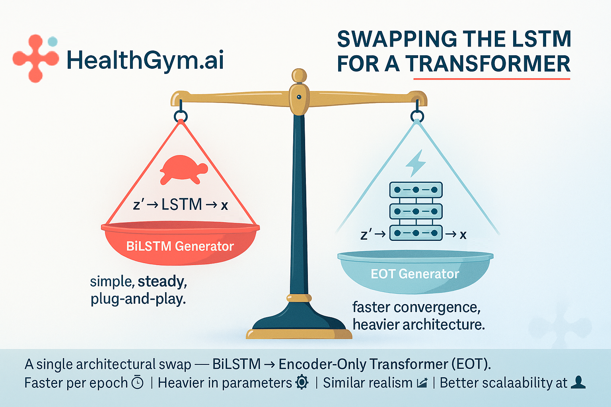

# Health Gym v2.5: Swapping the LSTM for a Transformer



Hey, hello, and Kia Ora!

In this post, we are testing more contemporary deep neural networks and seeing whether there are any effects from replacing the generator’s BiLSTM backbone with a lightweight Encoder-Only Transformer (EOT).

---

## The One and Only Change

The v2.5 code is [here](https://github.com/NicKuo-ResearchStuff/Health_Gym_AI/tree/main/Blogs/Blogs005_HandsOn(HealthGymV2.5)); and let’s recap the full pipeline before and after.

```
# Health Gym v2  (baseline)
RAW → PREPROCESS/DESIGN → CURRICULUM(L=10…60)
          │                    │
          ├──► CORR_real ◄─────┘
          └──► AE memory (μ buffer, T_SD)

z ~ U(0,1) ──► z' = z * T_SD + μ_sampled ──► Generator[BiLSTM] ──► x_fake
                                         └─► Critic (WGAN-GP)
Loss:  -E[D(x_fake)] + λ_C · ||Corr(fake)-Corr(real)||₁
```

```
# Health Gym v2.5  (this work)
… (same preprocessing, curriculum, correlation, and AE memory) …

z' ──► Generator[EOT] ──► x_fake
      ^^^^^^^^^^^^^^^
      # The only modification — swapping the BiLSTM with an Encoder-Only Transformer.
```

That’s it.
No change to the AE, and no change to the latent buffer -- just a different temporal backbone for the generator.

---

## The New Code in v2.5

Inside the code, two things appear under the familiar marker:

```python
###===>>> New stuff here for V2.5 <<<===###
class MyEncoderOnlyTransformer(nn.Module):
    ...
```

and later inside the generator:

```python
###===>>> New stuff here for V2.5 <<<===###
class Generator(nn.Module):
    def __init__(...):
        ...
        self.EOT = MyEncoderOnlyTransformer(ID, HD)
        ...
    def forward(self, x0):
        x1 = self.EOT(x0)
        x4 = self.linear3(x1)
        ...
```

Everything else -- critic, autoencoder, correlation term, training loop -- is unchanged.

So conceptually, you can think of v2.5 = v2 + (swap LSTM → Transformer).

---

## What We Observed

After a round of experiments on the ART-for-HIV dataset (≈9k patients, 60 months):

### Pros

1. Faster convergence per epoch.
   The EOT generator reaches stability and realism faster than the LSTM version -- you get similar correlation alignment and realism metrics in fewer epochs.

2. Neural efficiency on short runs.
   The attention layers seem to "see" long-term dependencies sooner, making early-epoch samples already smooth and clinically coherent.

### Neutral

3. Given enough training, both converge similarly.
   When the LSTM generator is trained long enough, it catches up.
   So, for small or well-behaved datasets, EOT and LSTM produce nearly indistinguishable results in realism and correlation metrics.

### Cons

4. Heavier architecture.
   EOT introduces more parameters than BiLSTM, so strictly speaking it isn’t an apples-to-apples comparison.
   Setting it up (heads, layers, normalisation) takes more trial and error -- while LSTM works almost plug-and-play.

5. GPU-wise, EOT is faster per epoch but not cheaper overall.
   Fewer epochs, but each one uses more memory and more attention weights.

### Where It Might Shine

The ART-for-HIV dataset is compact, so both models perform equally well here.
But if you’re using large-scale registry data (say, >5 million patients or >200 timepoints), transformers could scale better and model global dependencies more efficiently than recurrent designs.

### The Takeaway

| Version  | Generator Backbone             | Key Benefit        | Comment                         |
| -------- | ------------------------------ | ------------------ | ------------------------------- |
| v2.0 | BiLSTM                         | Stable baseline    | Simple, reliable, plug-and-play |
| v2.5 | Encoder-Only Transformer (EOT) | Faster convergence | Heavier but more scalable       |

---

### Wrapping Up

Health Gym v2.5 is a modular experiment:
a single swap proving that you can drop in an Encoder-Only Transformer in place of an LSTM and still keep the rest of the generative-memory system intact.

In the next post, we’ll discuss mode collapse.

Cheers,</br>
\- Nic

(Last Edit: 2025-10-17)
