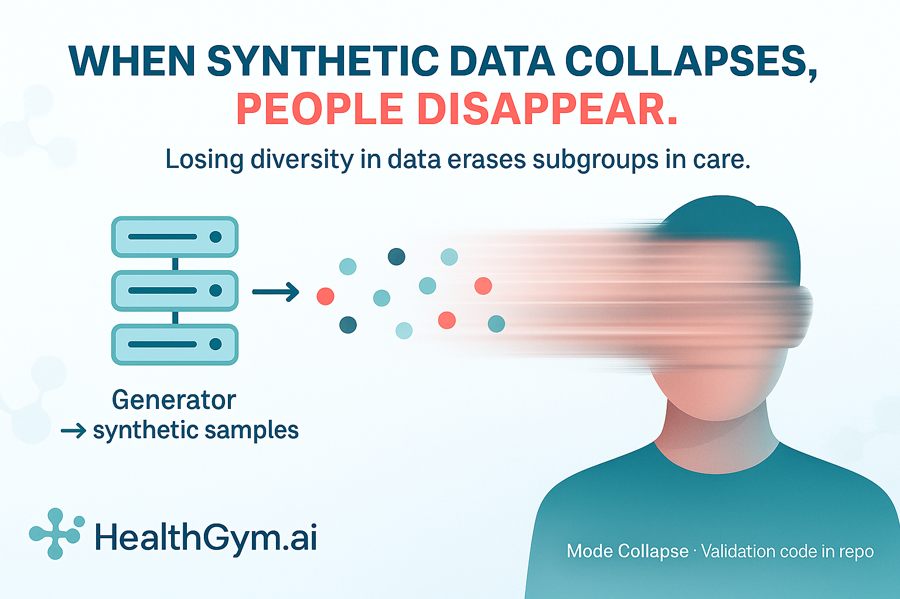
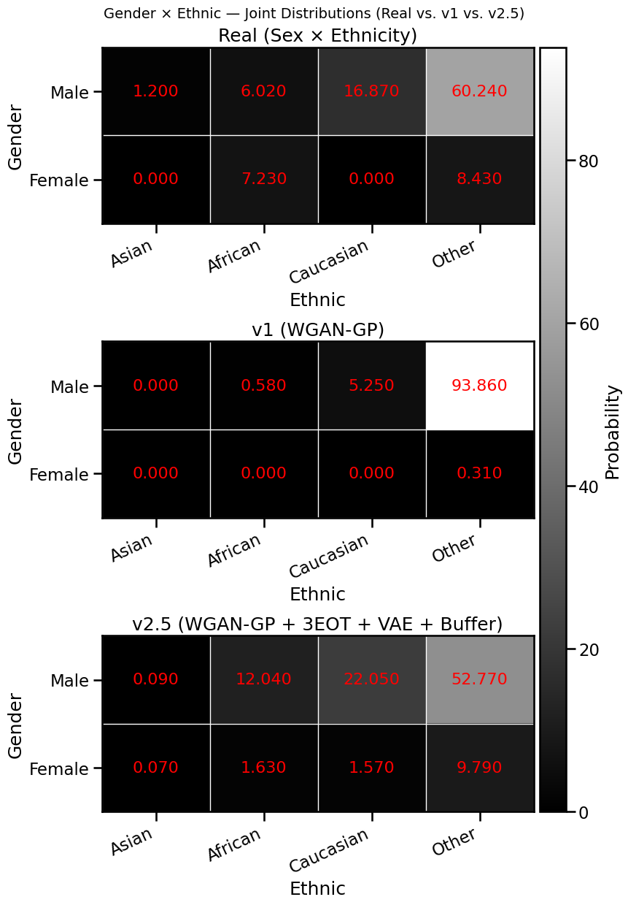

# When Synthetic Data Collapses, People Disappear

Hey, hello, and Kia Ora!

In this post, we’ll look at what’s called mode collapse, how it appears visually in our results, and why it’s not just a technical issue, but also a clinical and ethical one.

All code for validating mode collapse (including the Sex × Ethnicity heatmap shown below) is attached in this blog folder -- feel free to explore and run it yourself.

---

## What Is Mode Collapse?

Mode collapse happens when a generative model stops producing diverse examples.
Instead of recreating all the rich patterns of the real data, it learns to generate only a few of them -- repeating the same kinds of patients, trajectories, or lab patterns over and over again.

In clinical data, that means entire subgroups of patients could vanish.
For example, if our model only produces “Male–Other ethnicity” combinations, it forgets everyone else -- losing the diversity and fairness that make medical datasets meaningful.

---

## Visualising Mode Collapse: Real vs v1 vs v2.5

*Note: the results below are not from our Flagship Dataset*, 
*instead, they are trained from the scratch (see notebook in this folder)* 
*for demonstration purposes only*

The figure above compares Sex × Ethnicity distributions across three datasets:

1. Our ground truth
2. Health Gym v1 (WGAN-GP) (middle), lightly trained from the scratch for 100 epochs
3. Health Gym v2.5 (WGAN-GP + 3EOT + VAE + Buffer) (bottom), lightly trained from the scratch for 100 epochs

The real dataset has multiple modes -- a healthy mix of combinations, with both male and female patients appearing across ethnic groups.

In the v1 model, nearly everything collapses to the "Male–Other" combination.
Female and minority subgroups vanish almost completely.
This is multivariate mode collapse in action -- not just a single variable collapsing, but a whole combination of variables losing diversity.

In v2.5, diversity is restored.
The latent buffer and Transformer backbone reintroduce variation across both gender and ethnicity -- aligning the synthetic distribution more with the real cohort.

---

### Summary

| Aspect                | Ground Truth         | v1             | v2.5                    |
| :-------------------- | :----------- | :------------- | :---------------------- |
| Active modes          | 4+           | ≈1 (collapsed) | 4 (recovered)           |
| Female representation | ~15%         | <1%            | ~10%                    |
| Ethnic diversity      | High         | Low            | Restored                |
| Joint realism         | Ground truth | Collapsed      | Coherent, context-aware |

In short, Health Gym v1 collapsed onto a single dominant mode, whereas v2.5 re-expanded to capture the broader joint manifold of the real data.
That said, with only 100 training epochs, v2.5 still falls short of perfectly matching the ground truth. Further alignment could be achieved by training the model longer or fine-tuning the latent memory buffer, though exploring those refinements lies beyond the scope of this post — and is left as an open exercise for interested readers.

---

## When Mode Collapse Becomes Dangerous

This brings us to a crucial point.
If low-quality synthetic data — collapsed, biased, or unrealistic — is used as if it were real clinical data, the consequences ripple through both downstream modelling and medical applications.

| Consequence                          | Mechanism                           | Example                                                                |
| :----------------------------------- | :---------------------------------- | :--------------------------------------------------------------------- |
| Misclassification of risk        | Model learns skewed hazard curves   | Underestimating risk for women or minorities                           |
| Unsafe treatment recommendations | RL agents exploit spurious patterns | Recommending a drug purely because synthetic patients "improved" on it |
| Delayed or missed diagnosis      | Missing rare disease trajectories   | Model fails to identify atypical VL-CD4 responses                      |
| Erosion of clinician trust       | Inconsistent or biased outputs      | Clinicians reject or distrust AI altogether                            |

In short, when you treat low-quality synthetic data as ground truth, you create a double illusion -- one where the data seems safe, and another where the model seems accurate.
Together, they yield confident, explainable, and dangerously wrong decisions.

---

### Wrapping Up

By identifying, visualising, and addressing mode collapse early, we can standardise the generation and evaluation of medical datasets -- ensuring that the insights derived from them remain robust, representative, and safe for downstream clinical applications.

In the next post, we’ll shift focus to a different data generation paradigm: diffusion models.

Cheers, 
\- Nic

(Last Edit: 2025-10-20)
