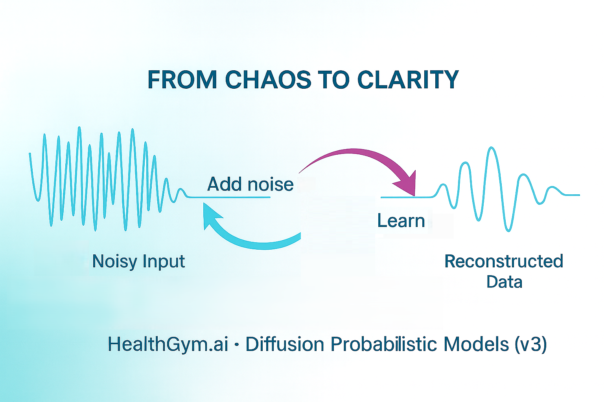

# Health Gym v3: From Chaos to Clarity



Hey, hello, and Kia Ora!

In this post, we’ll introduce the conceptual leap behind Health Gym v3 -- from using GAN-based training to a diffusion-based learning process for generating realistic synthetic health data.

If you’ve followed the Health Gym journey since [v1](https://github.com/NicKuo-ResearchStuff/Health_Gym_AI/tree/main/Blogs/Blogs003_HandsOn(HealthGymV1)) and [v2.5](https://github.com/NicKuo-ResearchStuff/Health_Gym_AI/tree/main/Blogs/Blogs005_HandsOn(HealthGymV2.5)), you’ll remember how we relied on GANs to produce synthetic patient trajectories.
GANs can be temperamental -- sometimes unstable and occasionally prone to mode collapse, where [entire patient subgroups vanished](https://github.com/NicKuo-ResearchStuff/Health_Gym_AI/tree/main/Blogs/Blogs_Z_Implementation/Implementation18).

Health Gym v3 moves beyond this adversarial paradigm, and adopts [Diffusion Probabilistic Model (DPMs)](https://arxiv.org/abs/2006.11239) -- where we first add noise to real data and then learn to remove it step by step.

---

## From Adversarial Training to Diffusion Learning

Let’s start by revisiting what our older models did.

---

### The GAN Learning Loop

```
───────────────────────────────────────────────────────────────────────────────
                         G A N   /   W G A N - G P
───────────────────────────────────────────────────────────────────────────────

[ Real Clinical Dataset ] ──► Sample Real Batch ───────────────┐
                                                               │
[ Latent Noise Inputs ] ──► Sample z ~ N(0,I) ─► Generator ────┤
                                                               ▼
                                                        ┌─────────────────┐
                                                        │ Critic Network  │
                                                        │ (Discriminator) │
                                                        └─────────────────┘
                                                         ▲           ▲
                                                         │           │
                                                Evaluate Real   Evaluate Fake
                                                  Samples          Samples
                                                         │           │
                                                         └────┬──────┘
                                                              ▼
                                                Compare Real vs Synthetic
                                                              │
                                                              ▼
                                                      Compute Loss
                                                              │
                                        ┌─────────────────────┴─────────────────────┐
                                        │                                           │
                              Update Critic Parameters                Feedback to Generator
                                        │                                           │
                                        └─────────────────────┬─────────────────────┘
                                                              ▼
                                                Update Generator Parameters
                                                              │
                                                              ▼
                                           Repeat Adversarial Training Loop
                                       Until Synthetic Data ≈ Real Data Distribution
───────────────────────────────────────────────────────────────────────────────
```

In GANs, two models compete --
the generator tries to create convincing synthetic data,
while the critic (or discriminator) tries to tell real from fake.

---

### The Diffusion Learning Loop

Health Gym v3 takes a different path.

```
───────────────────────────────────────────────────────────────────────────────
         D I F F U S I O N   P R O B A B I L I S T I C   M O D E L
───────────────────────────────────────────────────────────────────────────────

[ Real Clinical Dataset ] ──► Forward Diffusion Process ───────────────┐
                                                                       │
                             Gradually Add Gaussian Noise              │
                             (x₀ → x₁ → x₂ → … → x_T ≈ Pure Noise)     │
                                                                       ▼
                                                            ┌──────────────────┐
                                                            │    Backbone      │
                                                            │ (Denoising Model)│
                                                            └──────────────────┘
                                                                       ▲
                                                                       │
                                         Learn to Predict and Remove Noise at Each Step
                                                                       │
                                                                       ▼
                                                             Compute Reconstruction Loss
                                                                       │
                                                                       ▼
                                                             Update Backbone Parameters
                                                                       │
                                                                       ▼
                                         Repeat Across Noise Levels and Diffusion Steps
                                           Until Model Accurately Reverses Noise Process
───────────────────────────────────────────────────────────────────────────────
```

Instead of two competing networks, we now have one learner.
The process starts by adding noise to real data -- slowly corrupting it across many small steps until it becomes nearly random.
Then, the model learns to reverse this process -- to remove the noise and gradually reconstruct the original signal.

You can think of it as teaching the model how to "heal" damaged data.
Over time, the model internalises how to move from chaos to clarity -- from noise to data.

---

### Wrapping Up

Over the next few posts, we will start discussing the details on the implementation of the v3 model.

Cheers,</br>
\- Nic

(Last Edit: 2025-10-21)
