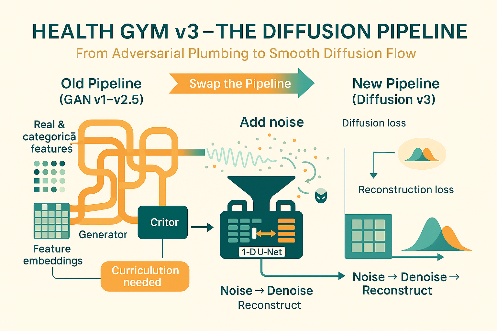

# Health Gym v3 — The Diffusion Pipeline
  

Hey, hello, and Kia Ora!

In this post, we’ll walk through the training loop of the Health Gym v3 diffusion model (see [here](https://github.com/NicKuo-ResearchStuff/Health_Gym_AI/blob/main/Blogs/Blogs006_HandsOn(HealthGymV3)/2025_10_23_HealthGymDiffusion_Example.ipynb)). However, we’ll stay at the pipeline level for now, and save the deeper dives on forward diffusion and reverse denoising for the next two posts.

---

## What the Trainer Manages

Similar to our previous GAN-based models, the `ExecuteB003` class prepares everything that defines the training:

| Component                                                | Purpose                                                                |
| -------------------------------------------------------- | ---------------------------------------------------------------------- |
| U-Net Denoiser                                       | Learns to remove noise from corrupted sequences.                       |
| Diffusion Schedule (`betas`, `alphas`, `alphas_bar`) | Defines how strongly each timestep corrupts or reconstructs data.      |
| Adam Optimiser                                       | Updates the U-Net’s parameters based on loss gradients.                |
| AMP Scaler                                           | Enables mixed-precision training for efficiency and stability.         |
| Training Config                                      | Holds hyperparameters: hidden size, steps, learning rate, epochs, etc. |

and calling `.train(loader)` triggers the following procedure:

```text
for epoch in 1..epochs:
    for each batch in Loader:
        preprocess → add noise → predict → reconstruct → compute losses → optimise
```
In our experiments, we found that curriculum learning, which was essential for stabilising GAN training, was no longer necessary for the diffusion model.
That said, if you prefer a staged learning setup, you can easily re-introduce curriculum training into your own pipeline using the provided code structure.

---

### A Note on Feature Handling

In the earlier GAN-based Health Gym models, each variable first passed through a [feature-type-aware embedding pipeline](https://github.com/NicKuo-ResearchStuff/Health_Gym_AI/tree/main/Blogs/Blogs_Z_Implementation/Implementation02) before entering the network:

* Numeric variables were transformed through linear layers.
* Categorical variables were mapped via embedding look-ups.
* The resulting dense vectors were concatenated to form the patient-level latent representation.
* The generator’s output then used block-wise activations (sigmoid for reals, softmax for categoricals) to restore valid ranges and categories.

In contrast, the diffusion model operates directly in the covariate space itself:

* Before training, all numeric variables are scaled to [0, 1], and categorical variables are one-hot encoded into separate columns.
* The U-Net therefore receives features that are already in a continuous, model-ready format -- no embeddings or concatenations are required.
* During training, the model simply adds and removes noise in this flattened, mixed-type feature space.
* After denoising, type-specific structure is restored during decoding:

  * Real-valued blocks are rescaled and inverse-transformed back to clinical units.
  * Categorical blocks are re-normalised with softmax per one-hot span and converted to final labels via `argmax` or sampling.


---

### Draw a Random Timestep and Add Noise

For every sequence, the trainer randomly picks a timestep `t` and creates Gaussian noise `η`.
Together, these define a corrupted input `x_t` -- the "fuzzy" version of the patient trajectory that the model will try to clean.

We won’t detail how the noise is added yet -- that’s for the upcoming post on Forward Diffusion.

---

### Predict and Reconstruct

The U-Net sees the noisy `x_t` and its timestep `t`, and returns a predicted noise `ε̂`.
From that, we can derive an estimate of the clean data `x̂₀`; giving us the predicted noise and reconstruct data, helping us to compute two losses:

| Loss                    | Symbol                 | Meaning                                               |
| ----------------------- | ---------------------- | ----------------------------------------------------- |
| Diffusion Loss      | `L_diff = MSE(ε̂, ε)`  | How accurately the model predicts the noise it added. |
| Reconstruction Loss | `L_rec = MSE(x̂₀, x₀)` | How well it can recover the original clean input.     |

The total loss is
`L_total = L_diff + recon_weight × L_rec`.

Through our experiemtns, we found out that the reconstruction objective is usually much smaller than the diffusion objective; hence we need a fairly large `recon_weight` (defaulted as 20).

---

### Optimise, Scale, and Clip

Gradients are scaled with `GradScaler`, back-propagated, and clipped to a maximum norm to prevent explosion -- a safety net for long sequences and mixed precision.

```python
self.scaler.scale(loss).backward()
self.scaler.unscale_(self.optimiser)
clip_grad_norm_(self.UNet.parameters(), self.cfg.grad_clip)
self.scaler.step(self.optimiser)
self.scaler.update()
```
---

## Wrapping Up

In the next two posts, we’ll open the hood on the core mechanics:

1. Forward Diffusion -- how clean data is methodically perturbed by noise across T steps.
2. Reverse Reconstruction -- how the model walks back from chaos to clarity using its learned noise predictor.

Cheers,</br>
\- Nic

(Last Edit: 2025-10-24)
