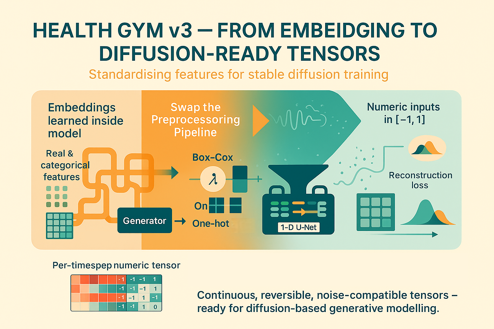

# Health Gym v3: From Embeddings to Diffusion-Ready Tensors

  

Hey, hello, and Kia Ora!

Before the Health Gym v3 model can learn to "diffuse" patient trajectories from noise, we first need to prepare the data in a way that’s mathematically clean, reversible, and noise-compatible.

In this post, we will unpack the preprocessing pipeline -- Box–Cox + one-hotting -- that powers the diffusion model.

---

## From GAN Embeddings to Diffusion-Ready Design Matrices

In the earlier GAN versions, each patient’s data entered the model through a learned embedding layer.
Continuous variables passed through linear projections, while categorical features were mapped through embedding lookups.

Diffusion models, however, work differently.
They directly inject Gaussian noise into every input channel -- which means all inputs must share a comparable numeric space. That requires standardising the feature space before training, not learning it inside the network.

Here’s a quick side-by-side summary:

| Aspect                          | GAN pipeline (Implementation 03)                                                                                                                                                                 | Diffusion pipeline (ExecuteB002)                                                                                                                                                                                                                |
| ------------------------------- | ------------------------------------------------------------------------------------------------------------------------------------------------------------------------------------------------ | ----------------------------------------------------------------------------------------------------------------------------------------------------------------------------------------------------------------------------------------------- |
| Numeric scaling             | Labs (*e.g.,* `VL`, `CD4`) were pre-scaled “somewhere upstream” and then passed through a tiny `Linear(1→1)` projection inside the embedding module. Scaling method wasn’t enforced at this stage. | Explicit, schema-driven scaling: per-column Box–Cox (λ fitted on the cohort) then min–max to [0,1] using stored `min/range` (via `compute_boxcox_params`). Optionally a legacy path reproduces the old constants.               |
| Categoricals                | Integers fed to `nn.Embedding(num_classes, emb_dim)` inside the model (learned dense codes, no one-hot at input). Indices were clamped to range at runtime.                                  | Materialised one-hot blocks in the design matrix before the model. Strict range validation (error if any code ∉ `[0..K-1]`). No embeddings at input; everything is continuous floats already.                                     |
| Representation fed to model | Per-timestep dense embedding vector assembled inside the model: real→Linear, cat/bin→Embedding, then concat → `[B, T, Σ emb_i]`.                                                         | A fully numeric tensor in [0,1] with explicit one-hot channels for cats and scaled reals for labs: shape `[B, T, D_total]`. Trainer then recentres to [-1,1] (`Recentre_Data`) just before adding Gaussian noise.               |
| Schema contract             | `dtype` defined embedding sizes and index spans for slicing inside the embedding module.                                                                                                         | `dtype` defines contiguous channel spans that are actually materialised in X (reals occupy width 1; categoricals occupy width `num_classes`). `expand_feature_names` yields the exact flat column names (`Base_Drug_Combo_0..5`, etc.). |
| Noise compatibility         | Noise applied in latent space; input scale mismatches were tolerated.                                                                                                                            | Noise applied directly on data channels — hence all features must be continuous and bounded.                                                                                                                                            |
| Decoding / reversibility    | Relied on heuristic scaling and softmax heads.                                                                                                                                                   | Exact inverse transforms via stored Box–Cox λ/min/range; categoricals recovered by argmax over one-hot spans.                                                                                                                               |

---

## How the Diffusion Preprocessing Works

Below is the simplified flow diagram of the Health Gym v3 data preparation process -- from raw clinical tables to diffusion-ready tensors.

```markdown
───────────────────────────────────────────────────────────────
   HEALTH GYM v3 — DIFFUSION DATA PREPROCESSING PIPELINE
───────────────────────────────────────────────────────────────

[1] RAW DATA  
     → ART-for-HIV table with mixed numeric and categorical fields.

[2] TYPE MAPPING  
     → Convert categorical strings to integer codes (BinCat2Num) and rename columns.

[3] BUILD FEATURE SCHEMA  
     → Define each feature’s span (index_start/index_end) using build_dtype().

[4] REAL FEATURES  
     → Apply Box–Cox transform + scale to [0,1]; store λ, min, range for reversibility.

[5] CATEGORICAL FEATURES  
     → One-hot encode all categorical/binary columns into float blocks.

[6] DESIGN MATRIX  
     → Concatenate all features into X ∈ ℝ^{N_patients × seq_len × D_total}.

[7] TORCH DATASET  
     → Convert to tensors and build DataLoader for training batches.

[8] FLATTEN FOR STATS  
     → Flatten [N, L, D] → [N×L, D] for correlation and audit metrics.

[9] TRAINER PREPARATION  
     ─────────────────────
     Inside diffusion trainer (ExecuteB003):  
       * Apply Recentre_Data(X) → map [0,1] → [-1,1]  
       * Pad/crop sequences to TARGET_LEN (e.g. 100)  
       * Create time masks for variable-length batches  
       * Add Gaussian noise at random timestep t  
       * U-Net learns to predict and remove that noise

```

After following the above flow, each patient’s record becomes a clean, numeric tensor.
Here’s a small mock example showing one patient’s data (4 timesteps × 22 features):

| timestep | VL    | CD4   | Gender_0 | Gender_1 | Ethnic_0 | Ethnic_1 | Ethnic_2 | Ethnic_3 | Base_Drug_Combo_0 | …  | Extra_PI_5 | Extra_pk_En_0 | Extra_pk_En_1 |
| -------- | ----- | ----- | -------- | -------- | -------- | -------- | -------- | -------- | ----------------- | -- | ---------- | ------------- | ------------- |
| 0        | 0.50  | -0.30 | 1        | -1       | -1       | -1       | 1        | -1       | -1                | …  | -1         | -1            | 1             |
| 1        | 0.25  | 0.05  | 1        | -1       | -1       | -1       | 1        | -1       | -1                | …  | -1         | -1            | 1             |
| 2        | 0.00  | 0.40  | 1        | -1       | -1       | -1       | 1        | -1       | -1                | …  | -1         | -1            | 1             |
| 3        | -0.30 | 0.70  | 1        | -1       | -1       | -1       | 1        | -1       | …                 | -1 | -1         | 1             | 1             |

In short:
After preprocessing, each patient’s data becomes a continuous 22-dimensional vector per timestep (in [–1, 1]) that seamlessly combines Box–Cox–scaled labs and one-hot categorical features.

---

## Wrapping Up

Remember to test the [source code](https://github.com/NicKuo-ResearchStuff/Health_Gym_AI/blob/main/Blogs/Blogs006_HandsOn(HealthGymV3)/2025_10_23_HealthGymDiffusion_Example.ipynb) to see the differences yourself!

Cheers,</br>
\- Nic

(Last Edit: 2025-10-27)
