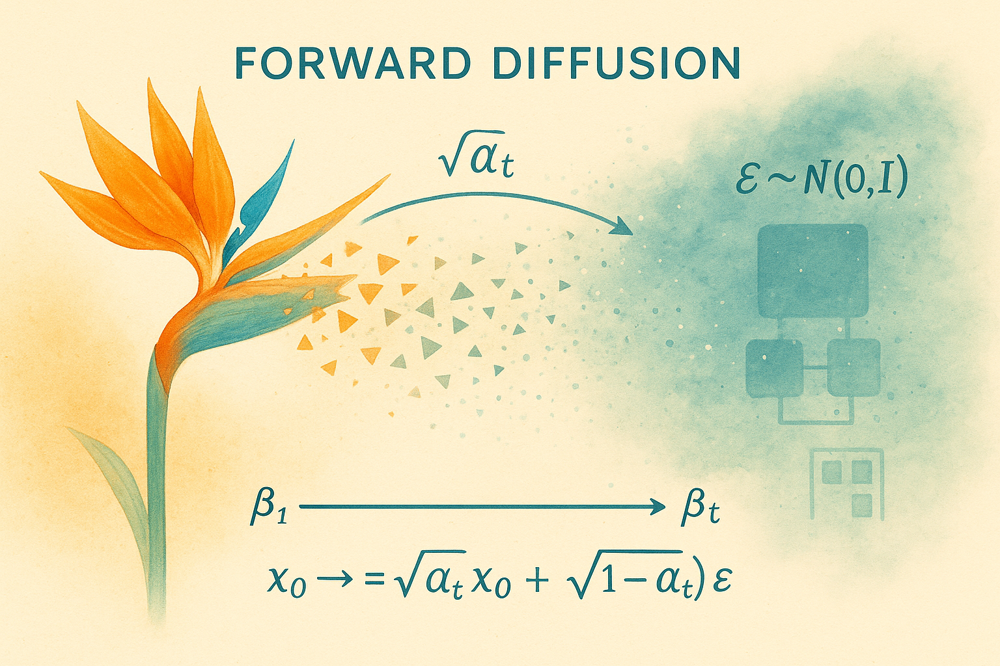

# Health Gym v3: Forward Diffusion



Hey, hello, and Kia Ora!

In this post, we will zoom into the forward diffusion process. On how three numbers define the noise process, how the schedule is built and stored, how a clean sequence $x_0$ becomes a noisy $x_t$, and how the ε-prediction loss ties training to that forward process.

---

## Three Knobs

At the top of the stack are three hyperparameters -- the global diffusion configuration:

| Variable   | Meaning                       | Role                                                                       |
| ---------- | ----------------------------- | -------------------------------------------------------------------------- |
| `T_STEPS`  | Number of diffusion steps ($T$) | Granularity of corruption/reconstruction; larger ($T$) → smoother but slower |
| `BETA_MIN` | Starting noise variance $\beta_1$    | Tiny perturbation at the first step                                        |
| `BETA_MAX` | Final noise variance $\beta_T$      | Corruption strength at the last step (near pure noise)                     |

These feed directly into the schedule:

```python
betas = torch.linspace(BETA_MIN, BETA_MAX, T_STEPS)
alphas = 1.0 - betas
alphas_bar = torch.cumprod(alphas, dim=0)
```
where
$\bar\alpha_t=\prod_{i=1}^{t}\alpha_i$ tells us how much original signal remains at step ($t$).

---

## Storing in the Pipeline

We store these information in the pipeline (*i.e.,* in [ExecuteB003](https://github.com/NicKuo-ResearchStuff/Health_Gym_AI/blob/main/Blogs/Blogs006_HandsOn(HealthGymV3)/2025_10_23_HealthGymDiffusion_Example.ipynb)) as

```python
betas = torch.linspace(cfg.beta_min, cfg.beta_max, cfg.n_steps, device=device)
alphas = 1.0 - betas
alphas_bar = torch.cumprod(alphas, dim=0)

self.register_buffer("betas", betas)
self.register_buffer("alphas", alphas)
self.register_buffer("alphas_bar", alphas_bar)
```
The buffers ensure that no gradients are computed from them (*i.e.,* information being frozen).

---

## The Forward Equation

With the schedule in place, we can generate a noised sample at any step (t) without simulating every prior step:

$x_t = \sqrt{\bar\alpha_t} x_0 + \sqrt{1-\bar\alpha_t}\epsilon \qquad \epsilon\sim\mathcal{N}(0, I).$

That’s exactly what `Manual_Forward` implements:

```python
def Manual_Forward(self, x_T0, Cur_T, Cur_Eta):
    a_bar = self.alphas_bar[Cur_T].view(-1, 1, 1, 1)  # broadcast over channels/time
    return a_bar.sqrt() x_T0 + (1.0 - a_bar).sqrt() Cur_Eta
```

`x_T0` is the clean batch (after recentring to ([-1,1]) and padding).
`Cur_T` is a vector of timesteps, one per sequence.
`Cur_Eta` is the Gaussian noise with the same shape as `x_T0`.

This lives in the training loop as:
```python
# (Cur_X_padded is x0 after recentering/padding)
Cur_T   = torch.randint(0, self.cfg.n_steps, (B,), device=self.device)   # sample t
Cur_Eta = torch.randn_like(Cur_X_padded)                                  # sample ε ~ N(0,I)

with autocast(ac_kwargs):
    Fuzzy_X  = self.Manual_Forward(Cur_X_padded, Cur_T, Cur_Eta)          # x_t
```
where we 
1. Sample randomness: pick a timestep (t) and draw noise (\epsilon).
2. Forward diffuse: compute (x_t) via `Manual_Forward`.

Everything else in the pipeline is just about modelling and optimisation.

---

## A Summary of the Forward Diffusion Components

```
[Block 1: T_STEPS, BETA_MIN, BETA_MAX]
                │
                ▼
[Block 2: betas, alphas=1-betas, alphas_bar=cumprod]  (registered as buffers)
                │
   ┌────────────┴────────────┐
   │                         │
   │                 (Data prep outside blocks)
   │      Cur_X → Recentre_Data([-1,1]) → _pad_time → Cur_X_padded, mask
   │                         │
   │                         ▼
[Block 4: sample Cur_T, Cur_Eta ~ N(0,I)]
                │
                ▼
[Block 3: Manual_Forward]
Fuzzy_X = sqrt(ā_t)*x0 + sqrt(1-ā_t)*ε
                │
                ▼
               ...

```

---

## Wrapping Up

As shown above, the forward diffusion process of the DPM is defined explicitly by hand. In the next post, we’ll explore the reverse reconstruction process -- where a neural network learns to predict and remove the injected noise, gradually recovering meaningful structure from chaos.

Cheers,</br>
\- Nic

(Last Edit: 2025-10-28)
