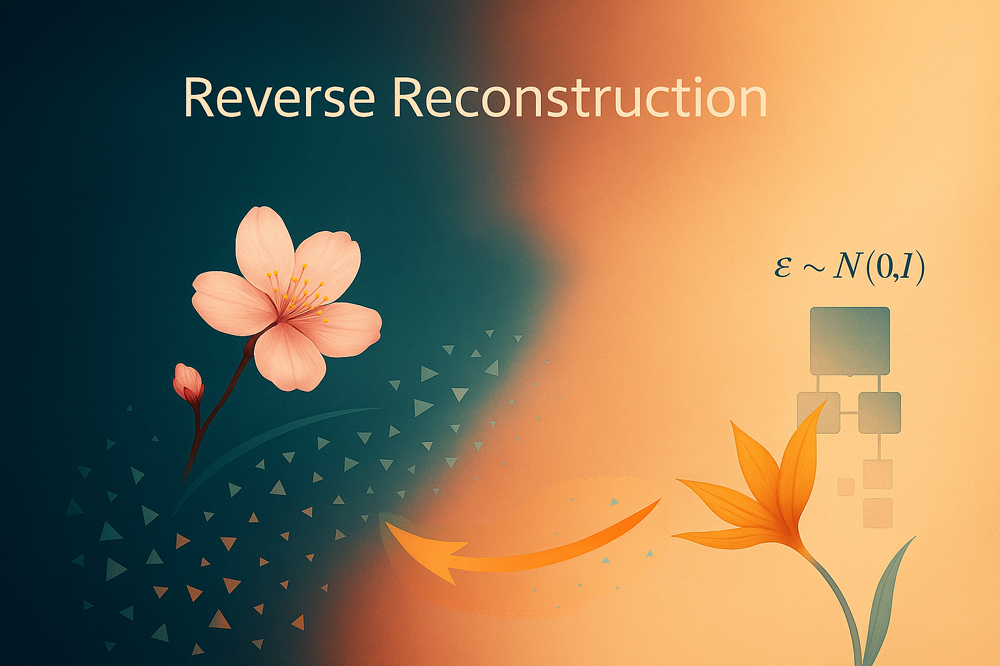

# Health Gym v3: Reverse Reconstruction



Hey, hello, and Kia Ora!

In the [previous post](https://github.com/NicKuo-ResearchStuff/Health_Gym_AI/tree/main/Blogs/Blogs_Z_Implementation/Implementation22), we built the forward diffusion process -- how a clean sequence ($x_0$) is gradually corrupted into ($x_t$) using three simple knobs: `T_STEPS`, `BETA_MIN`, and `BETA_MAX`.

In this post, we wukk look at how the model learns to reverse that process -- predicting and removing noise step-by-step to reconstruct the clean input.

---

## Shared Foundations

Both forward diffusion and reverse reconstruction share several core ingredients:

| Shared Element                       | Purpose                                              | Location in Code                               |
| ------------------------------------ | ---------------------------------------------------- | ---------------------------------------------- |
| `T_STEPS`, `BETA_MIN`, `BETA_MAX`    | Define the noise schedule across timesteps           | Registered in [`ExecuteB003`](https://github.com/NicKuo-ResearchStuff/Health_Gym_AI/blob/main/Blogs/Blogs006_HandsOn(HealthGymV3)/2025_10_23_HealthGymDiffusion_Example.ipynb) buffers            |
| `alphas_bar`                         | Cumulative signal retention ratio ($\bar{\alpha}_t$) | Used in both forward and reverse equations     |
| `Manual_Forward`                     | Generates the noised version ($x_t$)                   | Inside the training loop before reconstruction |
| `Cur_T`, `Cur_Eta`                   | Sampled timestep and Gaussian noise                  | Drawn per batch during training                |

Together, these provide themathematical symmetry between corruption and reconstruction

---

## Three Knobs for Successful Reverse Reconstruction

Just like forward diffusion, the reverse process depends on `T_STEPS`, `BETA_MIN`, and `BETA_MAX`, but now they determine how confidently and progressively the model denoises.


The key addition in the reverse process is the reconstruction loss weight, which balances how much the model cares about recovering structure versus predicting noise accurately:

| Variable       | Meaning                           | Role                                                                                                                                                     |
| -------------- | --------------------------------- | -------------------------------------------------------------------------------------------------------------------------------------------------------- |
| `RECON_WEIGHT` | Weight on the reconstruction term | Balances the ε-prediction loss with the x₀-recovery loss.</br>Larger → more emphasis on structural realism;</br> smaller → prioritises noise estimation accuracy. |

---

## The Reverse Reconstruction Equation

With the schedule in place and the UNet trained to predict noise, we can analytically invert the forward equation to recover the clean input:

$\hat{x}_0 = \frac{x_t - \sqrt{1 - \bar{\alpha}_t},\tilde{\epsilon}}{\sqrt{\bar{\alpha}_t}},$

where $x_t$ is the noised input,</br>
$\tilde{\epsilon}$ is a blend of thetruenoise and thepredictednoise,</br>
and $\bar{\alpha}_t$ determines how much of the original signal remains.

In code, this is exactly what `Reconstruct` implements:

```python
def Reconstruct(self, Fuzzy_X, Cur_T, Cur_Eta, Predicted_Eta):
    a_bar = self.alphas_bar[Cur_T].view(-1, 1, 1, 1)
    # blend true + predicted noise (can disable by setting blend=0)
    blend = torch.rand_like(Cur_Eta)
    Pred_Noise = blend Cur_Eta + (1.0 - blend) Predicted_Eta
    x0_hat = (Fuzzy_X - (1.0 - a_bar).sqrt() Pred_Noise) / (a_bar.sqrt() + 1e-8)
    return x0_hat
```
---

## Inside the Training Loop

The reverse reconstruction runs immediately after the forward diffusion and the UNet’s noise prediction:

```python
with autocast(ac_kwargs):
    Fuzzy_X  = self.Manual_Forward(Cur_X_padded, Cur_T, Cur_Eta)   # x_t
    Pred_Eta = self.Network_Backward(Fuzzy_X, Cur_T)               # ε̂θ(x_t, t)
    X_hat    = self.Reconstruct(Fuzzy_X, Cur_T, Cur_Eta, Pred_Eta) # x̂₀
```

1. Predict noise -- the UNet estimates $\hat{\epsilon}_\theta(x_t, t)$.
2. Blend & reconstruct -- combine true and predicted noise, invert the diffusion equation to get $\hat{x}_0$.
3. Compute losses -- masked MSE on both noise and reconstructed signal:

```python
loss_diff = self._masked_mse(Pred_Eta, Cur_Eta, mask)
loss_rec  = self._masked_mse(X_hat, Cur_X_padded, mask) self.cfg.recon_weight
loss      = loss_diff + loss_rec
```

---

## A Summary of the Reverse Reconstruction Components

```
[Block A: T_STEPS, BETA_MIN, BETA_MAX]
                │
                ▼
[Block B: betas → alphas=1-betas → alphas_bar=cumprod]  (registered as buffers)
                │
   ┌────────────┴────────────┐
   │                         │
   │                (Data prep outside blocks)
   │  Cur_X → Recentre_Data([-1,1]) → _pad_time → Cur_X_padded, mask ≡ x0 (target)
   │                         │
   │                         ▼
[Block C: sample Cur_T, Cur_Eta ~ N(0,I)]
                │
                ▼
[Block D: Manual_Forward]
Fuzzy_X = √(ā_t) x0 + √(1 - ā_t) ε               # x_t
                │
                ▼
[Block E: Noise Prediction (UNet)]
Pred_Eta = UNet(Fuzzy_X, Cur_T)                  # ε̂θ(x_t, t)
                │
                ▼
[Block F: Noise Blend (optional)]
blend ~ U(0,1)
Pred_Noise = blend Cur_Eta + (1 - blend) Pred_Eta
                │
                ▼
[Block G: Reconstruction]
x0_hat = ( Fuzzy_X - √(1 - ā_t) Pred_Noise ) / ( √(ā_t) + 1e-8 )
                │
                ▼
[Block H: Masked Losses]
loss_diff = MSE( Pred_Eta, Cur_Eta ) ⊙ mask
loss_rec  = MSE( x0_hat,  x0 ) ⊙ mask  × recon_weight
total     = loss_diff + loss_rec
```

---

## Wrapping Up

Despite being called the Diffusion Probabilistic Model (DPM), it is not a single model in itself. Instead, it is a learning framework -- one that defines both how noise is added and how it is later removed.
Within this framework lie the actual models that do the learning. In our case, that’s the U-Net, the component responsible for predicting and understanding all the noise. We’ll unpack its design and role in the next blog.

Cheers,</br>
\- Nic

(Last Edit: 2025-10-29)
