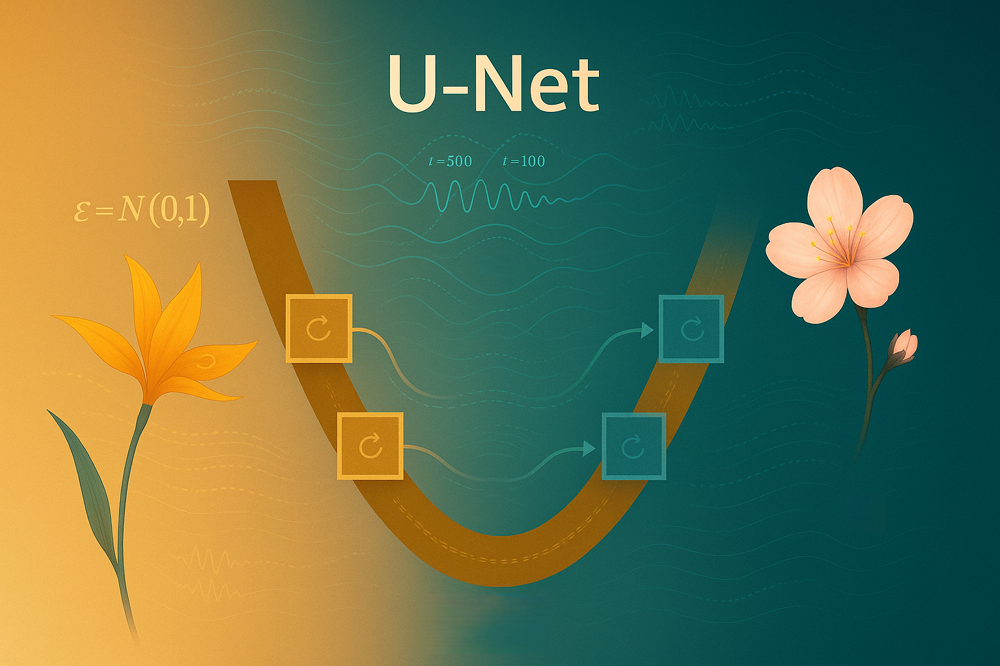

# Health Gym v3: Inside the U-Net



Hey, hello, and Kia Ora!

This post continues from the previous [Reverse Reconstruction blog](https://github.com/NicKuo-ResearchStuff/Health_Gym_AI/tree/main/Blogs/Blogs_Z_Implementation/Implementation23) and opens up the U-Net -- the component responsible for predicting noises, $\hat\epsilon_\theta(x_t, t)$.</br>
We will locate where it lives in the [code](https://github.com/NicKuo-ResearchStuff/Health_Gym_AI/blob/main/Blogs/Blogs006_HandsOn%28HealthGymV3%29/2025_10_23_HealthGymDiffusion_Example.ipynb), highlight the minimum knobs required to run its forward path, and show how the supporting functions connect to form the complete denoising pipeline.

This is not a general introduction to U-Net. Instead, it focuses on our customised 1-D, time-conditioned version used within the Health Gym diffusion framework for reconstructing longitudinal EMR data.</br>
For readers seeking a foundational overview of U-Net, we recommend [this excellent tutorial](https://medium.com/@fernandopalominocobo/mastering-u-net-a-step-by-step-guide-to-segmentation-from-scratch-with-pytorch-6a17c5916114).

---

## Where to find the U-Net in the code

Shortest path to the forward call:

```
Pred_Eta = self.Network_Backward(Fuzzy_X, Cur_T)
           └─ return self.UNet(Fuzzy_X, Cur_T)
```

Where the U-Net is built (inside `ExecuteB003.__init__`):

```python
self.UNet = MyUNet(
    Cur_HD       = self.cfg.hd,         # from HIDDEN
    N_Steps      = self.cfg.n_steps,    # from T_STEPS
    Time_Emb_Dim = 128,                 # constant here
    Feat_Dim     = 22,                  # constant here
    Len          = self.cfg.target_len  # from TARGET_LEN
).to(self.device)
```

Minimal dependencies (forward path only):

| Param          | Comes from       | Purpose                           |
| -------------- | ---------------- | --------------------------------- |
| `Feat_Dim`     | schema (`22`)    | channels per timestep             |
| `Len`          | `TARGET_LEN=100` | padded time length                |
| `Cur_HD`       | `HIDDEN=256`     | base channel width                |
| `N_Steps`      | `T_STEPS=500`    | size/indexing for time embeddings |
| `Time_Emb_Dim` | `128`            | FiLM embedding width              |

Once instantiated, `UNet(Fuzzy_X, Cur_T)` yields `Pred_Eta`, which the diffusion scaffold uses for reconstruction/sampling.

---

## The functions that support the U-Net

`build_sinusoidal_table(n_steps, dim)`: fixed sinusoidal lookup ([n_steps, dim]) for timestep (t).</br>
`TimeEmbedding`: turns (t) into FiLM parameters ((\gamma,\beta)) per channel via a small MLP over the sinusoidal vector.</br>
`ResBlock1D`: GroupNorm → (FiLM) → SiLU → Conv1d → GroupNorm → SiLU → (Dropout) → Conv1d + residual add.</br>
`MyUNet`: a 1-D U-Net (temporal) with per-time bt1/bt2 mixers at I/O and FiLM-conditioned ResBlock1Ds at every scale.</br>

---

## The U-Net’s three phases: Down → Mid → Up

Down: at each scale, apply FiLM-conditioned `ResBlock1D` → push to `skip` → downsample (Conv1d, stride 2) to halve the time axis.</br>
Mid: two FiLM-conditioned `ResBlock1D` at the coarsest scale to integrate global temporal context.</br>
Up: mirror the pyramid: upsample (ConvTranspose1d) → skip-add from the matching Down stage → FiLM-conditioned `ResBlock1D` to refine details.

Time awareness comes from:
`time_emb_down[i](t)` at each Down stage,</br>
`time_emb_mid(t)` at the bottleneck,</br>
`time_emb_up[i](t)` at each Up stage,</br>
each producing per-channel ($\gamma,\beta$) to modulate the normalised activations (FiLM).

---

## The Internal Wiring

```
INPUT
x_t [B,1,Feat,Len] ──> bt1 (per-time mixer) ──> x [B,C,L]
                            │
                            ▼
[A] For each down level i:
    (gamma_i, beta_i) = time_emb_down[i](t)
    x = ResBlock1D(x | gamma_i, beta_i)       # FiLM at scale i
    push x to skip
    x = Conv1d(stride=2)(x)                   # downsample L→L/2

                            │
                            ▼
[B] Mid (bottleneck):
    (g_mid, b_mid) = time_emb_mid(t)
    x = ResBlock1D(x | g_mid, b_mid)
    x = ResBlock1D(x | g_mid, b_mid)

                            │
                            ▼
[C] For each up level j (mirror order):
    x = ConvTranspose1d(stride=2)(x)          # upsample L→2L
    align length with skip[j] if needed
    x = x + skip[j]                           # skip add (detail restore)
    (g_up_j, b_up_j) = time_emb_up[j](t)
    x = ResBlock1D(x | g_up_j, b_up_j)        # FiLM at scale j

                            │
                            ▼
out_conv (Conv1d) ──> bt2 (per-time projector) ──> noise_hat [B,1,Feat,Len]
```

---

## The “little gadgets” and why they matter for EHR denoising

FiLM (from `TimeEmbedding`): lets every block adapt to diffusion timestep—stronger smoothing early (noisy), finer sharpening late (clean).</br>
GroupNorm: stable with small/variable batch sizes common in clinical workflows.</br>
Residual design: supports incremental corrections—ideal for iterative denoising where each step nudges $x_t$ toward $x_0$.</br>
1-D temporal convs: efficiently capture local trends ($e.g.,$ VL/CD4 dynamics, regimen changes), while the U-Net’s pyramid captures multi-scale context (visit-level patterns vs. longer trajectories).</br>
Skip connections: preserve short-range detail essential for realism ($e.g.,$ sharp lab shifts), complementing the global view from the bottleneck.

---

## What’s next

In the next post, we’ll open the U-Net’s dials: practical guidance on choosing `HIDDEN` (capacity), `TARGET_LEN` (temporal field), and `T_STEPS` (time conditioning) for your cohort; plus simple ablations (remove FiLM, flatten levels) to see exactly which parts carry the denoising lift.

Cheers,</br>
\- Nic

(Last Edit: 2025-10-30)
