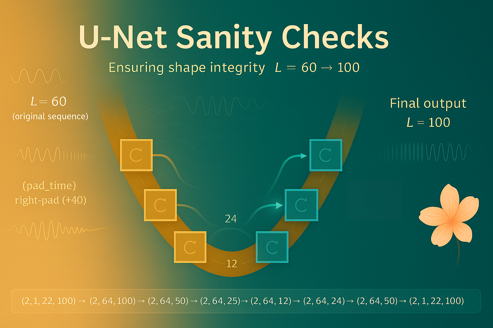

# Health Gym v3: U-Net Sanity Checks



Hey, hello, and Kia Ora!

In the [previous post](https://github.com/NicKuo-ResearchStuff/Health_Gym_AI/tree/main/Blogs/Blogs_Z_Implementation/Implementation24), we covered the hyper-parametric settings for the U-Net with 1D-CNNs that powers the Health Gym diffusion model.

This post takes a more practical turn, ensuring that every tensor entering and leaving the U-Net obeys the correct shape contract.

---

## Why sanity checks matter

The original ART for HIV dataset has patient records spanning for 60 months (*i.e.,* `SEQ_LEN = 60`).

However, our U-Net expects a fixed working length (`TARGET_LEN = 100`), because its down- and up-sampling layers halve and double the temporal dimension repeatedly.
If the input length isn’t a multiple of 2 across all levels, the convolution and transposed-convolution pairs won’t align -- causing silent mismatches, NaNs, or shape errors that propagate deep into training.

Hence, the first checkpoint in the pipeline is a padding step.

---

## Padding and masking

Before entering the model, the input is padded using the helper function `pad_time(x, tgt_len)`:

```python
x_pad, mask = pad_time(x, TARGET_LEN)
```

This operation:</br>
Right-pads the temporal axis from `L=60` → `L=100`</br>
Returns a binary `mask` marking the valid vs. padded timesteps</br>
Ensures that every batch shares a consistent temporal field</br>

```
(pad_time) right-pad from L=60 to 100 (+40)
Input (after padding): (2, 1, 22, 100)
```

The mask is later used in the evaluation phase to ignore loss contributions from the padded region, preserving clinical interpretability.

---

## Following the feature flow

The padded input `[B, 1, Feat, Len] = [B, 1, 22, 100]` travels through the following transformation chain:

| Stage  | Transformation                         | Output Shape      |
| ------ | -------------------------------------- | ----------------- |
| bt1    | per-time linear projection (`22 → 64`) | `[B, 64, 100]`    |
| Down 1 | ResBlock → Conv1d(k=4,s=2,p=1)         | `[B, 64, 50]`     |
| Down 2 | ResBlock → Conv1d(k=4,s=2,p=1)         | `[B, 64, 25]`     |
| Down 3 | ResBlock → Conv1d(k=4,s=2,p=1)         | `[B, 64, 12]`     |
| Mid    | two ResBlocks                          | `[B, 64, 12]`     |
| Up 1   | ConvT(k=4,s=2,p=1) → align(+1)         | `[B, 64, 25]`     |
| Up 2   | ConvT(k=4,s=2,p=1)                     | `[B, 64, 50]`     |
| Up 3   | ConvT(k=4,s=2,p=1)                     | `[B, 64, 100]`    |
| bt2    | per-time projection (`64 → 22`)        | `[B, 1, 22, 100]` |

This round-trip confirms the U-shaped geometry is stable and that all skip connections can safely add tensors of matching lengths.

---

## The alignment safeguard

During upsampling, small rounding effects appear when the temporal length becomes odd (*e.g.,* 25 → 12 → 24 instead of 25).
To guard against this, the model explicitly crops or pads:

```python
if x.size(-1) > skip[-1].size(-1):
    x = x[..., :skip[-1].size(-1)]
elif x.size(-1) < skip[-1].size(-1):
    pad = skip[-1].size(-1) - x.size(-1)
    x = F.pad(x, (0, pad))
```

So in practice, the model prints:

```
Align (pad) : (2, 64, 24) -> +1 to 25
```

This adjustment ensures that the temporal dimension always matches the stored skip tensor, keeping the reconstruction path perfectly symmetric.

---

## Why 1-D CNNs are sensitive to length

Unlike 2-D image U-Nets (where spatial crops are visually obvious), temporal convolutions in clinical data operate ons equential time steps -- meaning that any off-by-one mismatch silently shifts clinical meaning.
A missing month can offset an entire trajectory (*e.g.,* viral load spikes appearing earlier or later than reality).

Therefore, careful kernel-stride-padding design is essential:

| Parameter     | Role                   | Typical value |
| ------------- | ---------------------- | ------------- |
| `kernel_size` | Local temporal window  | 4             |
| `stride`      | Down/upsampling factor | 2             |
| `padding`     | Boundary correction    | 1             |
| `TARGET_LEN`  | ensures divisibility   | 100           |

When combined correctly, the U-Net halves/doubles sequence length cleanly at every level, even when the real data (like ART-HIV) is shorter.

---

## The sanity-check routine

To verify the above alignment, we run a simpler "shape trace" version of the network (see [here](https://github.com/NicKuo-ResearchStuff/Health_Gym_AI/blob/main/Blogs/Blogs_Z_Implementation/Implementation25/2025_10_31_UNetSanityCheck.ipynb)) that prints tensor dimensions at each stage:

```
After bt1/in_proj    : (2, 64, 100)
Down 1 (resblock)    : (2, 64, 100)
Down 1 (downsample)  : (2, 64, 50)
...
Up 3 (+skip,resblk)  : (2, 64, 100)
After bt2/out_proj   : (2, 22, 100)
Final output         : (2, 1, 22, 100)
```

This confirms that every transformation -- from padding to skip alignment -- behaves as intended, ensuring a mathematically consistent diffusion backbone.

Cheers,</br>
\- Nic

(Last Edit: 2025-10-31)
