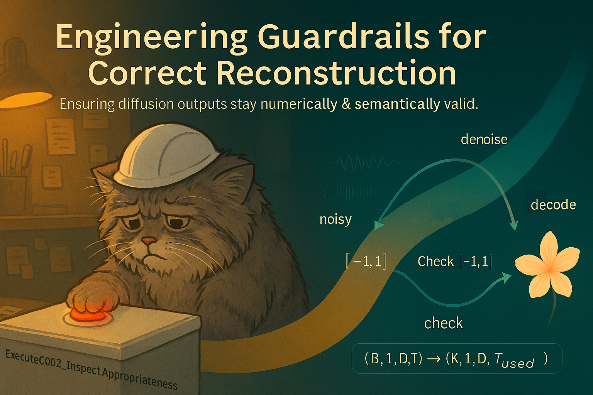

# Health Gym v3: Engineering Guardrails for Correct Reconstruction
> ⚠️ Caution — Engineering Deep Dive.</br>
> This post drills into implementation safeguards that keep diffusion outputs numerically & semantically valid during sampling and decode.
> If you’re after the high-level story, you can skip this one without missing the conceptual plot.



Hey, hello, and Kia Ora!

In the [previous sanity-checks post](https://github.com/NicKuo-ResearchStuff/Health_Gym_AI/tree/main/Blogs/Blogs_Z_Implementation/Implementation25) we ensured that every tensor entering and leaving the U-Net obeys the shape contract. Today we go one layer deeper: how we keep the values themselves correct during diffusion sampling and back-decoding -- *i.e.,* making sure reconstructed clinical variables (*e.g.,* VL, CD4) land back in meaningful ranges and categoricals remain valid.

---

## Why diffusion needs guardrails that GANs don’t?

Short answer: diffusion sampling breaks hard output constraints at every step; classic GAN generators enforce them at the final layer. So diffusion needs this extra “appropriateness” pass; your GANs typically don’t.

Here’s what’s going on:</br>
<ins>Where the model lives</ins></br>
Diffusion: the U-Net learns to predict noise in amodel spacewhere continuous features are recentered to [-1, 1] and categoricals float as soft one-hots during the entire denoising trajectory. Each reverse step re-injects Gaussian noise → values can drift outside [-1, 1] or become numerically messy.</br>
GAN: the generator outputs data space directly in one shot. You usually wire the last activations to satisfy constraints: `sigmoid` → [0,1] for reals, `softmax` per categorical group → (nearly) one-hot. No iterative noise adds to break those bounds.

<ins>Hard vs soft constraints</ins></br>
Diffusion: constraints aren’t baked into each step. Even if the final `x_0` is intended to be in-range, **the stochastic steps can yield out-of-bounds channels or overly soft categoricals**.</br>
Hence [`ExecuteC002_InspectAppropriateness`](https://github.com/NicKuo-ResearchStuff/Health_Gym_AI/blob/main/Blogs/Blogs006_HandsOn(HealthGymV3)/2025_10_23_HealthGymDiffusion_Example.ipynb):

    drops samples whose reals ever leave [-1, 1] over time,
    maps reals back from [-1,1] → [0,1] before decoding,
    preserves schema order for later Box–Cox inverse.
  GAN: the last layer already projects onto the feasible set. You may still post-process, but you don’t need a range filter because the network can’t emit out-of-range values if the heads are constrained.

<ins>Iterative noise vs single forward pass</ins></br>
Diffusion: stochastic T→0 loop ⇒ small numerical errors accumulate; plausibility checks help keep only “well-behaved” sequences.</br>
GAN: single forward ⇒ constraints applied once and held; no ancestral steps to violate them.</br>

<ins>Could a GAN benefit from a filter?</ins></br>
Sometimes you might still screen for clinical plausibility (*e.g.,* monotonic impossibilities), but not for basic numeric validity because the architecture already enforces range/one-hotness by design.

So, `ExecuteC002_InspectAppropriateness` is a diffusion-only hygiene layer: clip/select sequences that stayed numerically valid through the noisy reverse process and transform them back to the decoder’s expected [0,1] space. **GANs generally avoid this because their final activations already keep outputs in-bounds.**

---

## Where the inspect-correctness step lives

```
RAW CLINICAL DATA (VL, CD4, cats)
        │
        ├─ Box–Cox fit and scaling to [0,1]
        ├─ Integer mapping for categoricals
        ├─ Schema validation (dtype spans checked)
        └─ Combine into 3D design tensor [N,L,D]
                 │
                 ├─ Map to model space [-1,1]
                 ├─ Diffusion training (U-Net learns noise prediction)
                 └─ Save trained model & buffers
                              │
               ┌──────────────┴─────────────────────┐
               │                                    │
          SAMPLING LOOP (DDPM)                 TRAINING DONE
         x_T ~ N(0,I) → iterative denoise      (ready to decode)
               │
               ├─ Denoising steps: x_t → x_{t-1}
               ├─ Keep first Generated_Len steps
               │
               ▼
# ===================================#
# ExecuteC002_InspectAppropriateness #
# ===================================#
               ▲
               │
               └─ Only sequences with valid real-channel bounds survive
                              │
                              ├─ Flatten accepted [K,1,D,T_used] → [K*T_used, D]
                              ├─ ExecuteC002_BTS: inverse Box–Cox + argmax cats
                              └─ Output tidy DataFrame (original clinical units)
                                       │
                             FINAL SYNTHETIC DATASET
                             ├─ Reals safely decoded to original range
                             └─ Categoricals in valid integer codes
```

---

## Inside `ExecuteC002_InspectAppropriateness`

```
FUNCTION: ExecuteC002_InspectAppropriateness
Purpose:
  Filter diffusion-model outputs to keep only numerically valid sequences
  (reals within [-1,1] across time) and rescale reals back to [0,1].

INPUTS
  noisy_X   → [B, 1, D, T] tensor (model-space output)
  dtype     → schema (defines which dims are reals vs categoricals)
  valid_len → optional truncation of time dimension
OUTPUT
  out → [K, 1, D, T_used] tensor (K ≤ B)

1) Sanity check: assert [B,1,D,T]
2) Time handling: optional truncate to T_used (e.g., 60)
3) Identify spans: read real & categorical blocks from dtype (fallback: first two = reals)
4) Separate blocks: gather reals to [B,1,R,T]; concat cats to [B,1,C,T]
5) Range validation: keep sequences whoseeveryreal channel stays within [-1,1] over time
6) Rescale accepted reals: [-1,1] → [0,1] to match decoder’s expectation
7) Reassemble: scatter reals & cats back to original feature order D
8) Return [K,1,D,T_used]: ready for inverse Box–Cox & categorical argmax decoding
```

Why this matters:</br>
Prevents range creep from iterative denoising.</br>
Guarantees the decoder receives inputs in the right numeric domain ([0,1] for reals).</br>
Keeps feature ordering intact for schema-driven inverse transforms.</br>
Provides a quality gate: only sequences obeying the model-space contract proceed.

---

## Line-by-line understanding...

Below is the annotated reading guide (kept concise but precise).

```python
    """
    Args:
      noisy_X : [B, 1, D, T] tensor in model space (reals in [-1,1], cats ~ one-hot-ish)
      dtype   : schema manifest to locate real/categorical spans (recommended)
      valid_len: if provided, keep only the first valid_len time steps

    Returns:
      filtered tensor [K, 1, D, T_used] with reals mapped to [0,1]
    """
```

*Docstring clarifies shapes, semantics, and return value (`K ≤ B` accepted sequences).*

```python
    B, _, D, T = noisy_X.shape
```

*Unpacks dimensions.*

```python
    # figure spans
    if dtype is not None:
        real_cols, cat_groups = _dtype_spans(dtype)
        real_slices = [slice(s, e) for _, s, e in real_cols]
        cat_slices  = [slice(s, e) for _, s, e in cat_groups]
```

*Compute contiguous index spans for real and categorical feature blocks from `dtype`, as Python `slice`s.*

```python
    # stack reals into one tensor [B, 1, R, T]
    real_idx = torch.cat([torch.arange(s.start, s.stop, device=device) for s in real_slices])
```

*Build a flat index vector of all real feature positions on the correct device.*

```python
    reals = noisy_X[:, :, real_idx, :]  # [B,1,R,T]
```

*Gather real features into a compact block (new third dim `R` = #real channels).*

```python
    cats  = torch.cat([noisy_X[:, :, s, :] for s in cat_slices], dim=2) if cat_slices else noisy_X.new_zeros((B,1,0,T_used))
```

*Concatenate all categorical blocks along feature dimension (`dim=2`).
If no categorical slices, create an empty width-0 tensor with correct dtype/device.*

```python
    # filter: min >= -1 and max <= 1 across time for all real channels
    min_ok = reals.amin(dim=3) >= -1.0    # [B,1,R]
    max_ok = reals.amax(dim=3) <=  1.0    # [B,1,R]
```

*Compute per-sequence, per-real-channel min and max over time; test bounds.*

```python
    good   = (min_ok & max_ok).sum(dim=2).squeeze(1) == reals.size(2)  # [B]
```

*A sequence is good iff all real channels satisfy the bounds
(boolean AND per channel → count channels passing → equal to `R`?).*

```python
    reals  = reals[good]
    cats   = cats[good]
```

*Keep only accepted sequences for both real and categorical blocks.*

```python
    # map reals [-1,1] -> [0,1]
    reals = (reals + 1.0) 0.5
```

*Affine rescale of real channels to decoder’s expected range.*

```python
    # reassemble in original feature order D
    out = noisy_X.new_zeros((reals.size(0), 1, D, T_used))
```

*Allocate output tensor with accepted batch size `K`, full feature width `D`, time `T_used`, zero-initialised.*

---

Cheers,</br>
– Nic

(Last Edit: 2025-11-03)
