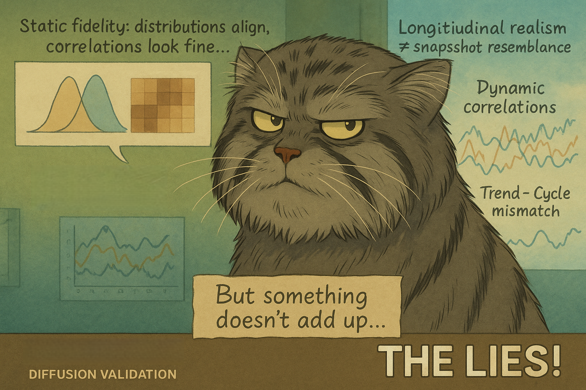
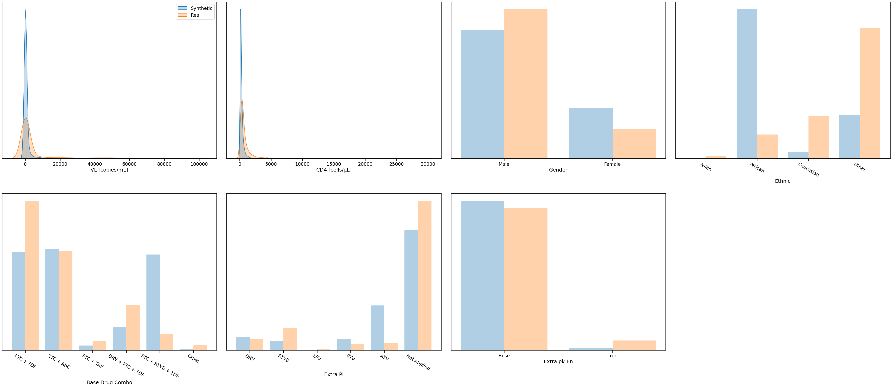
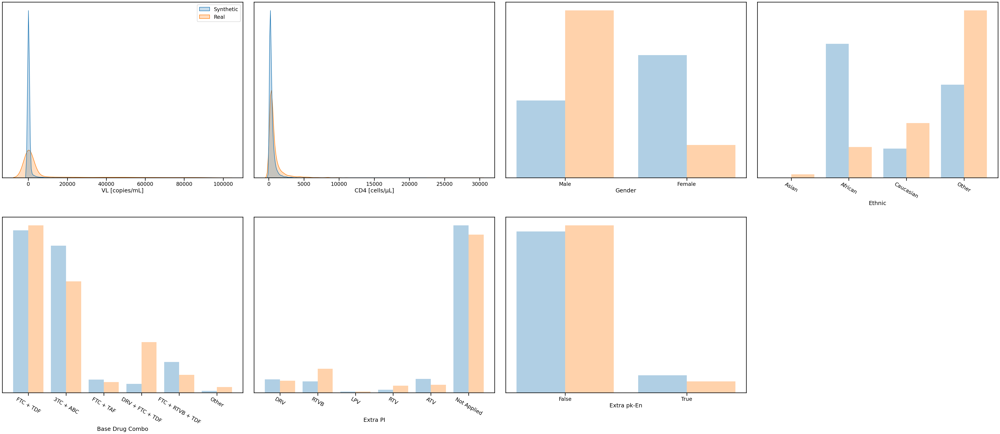
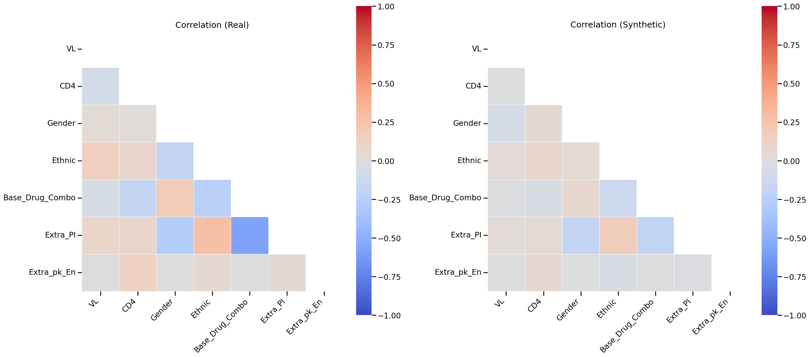
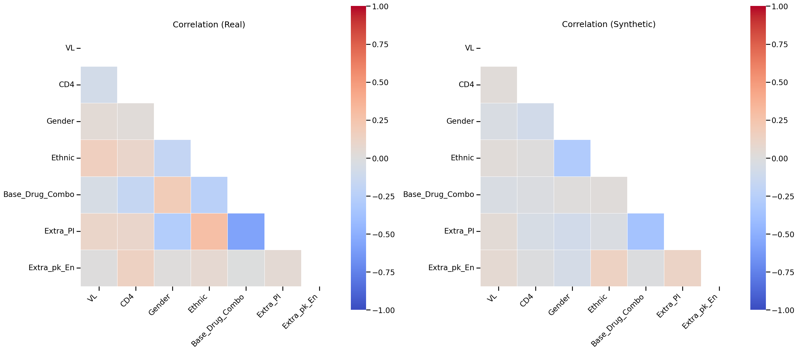
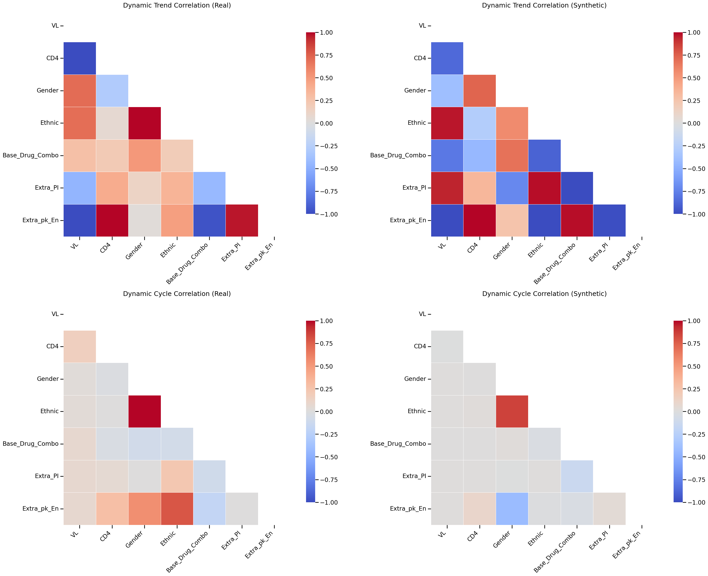
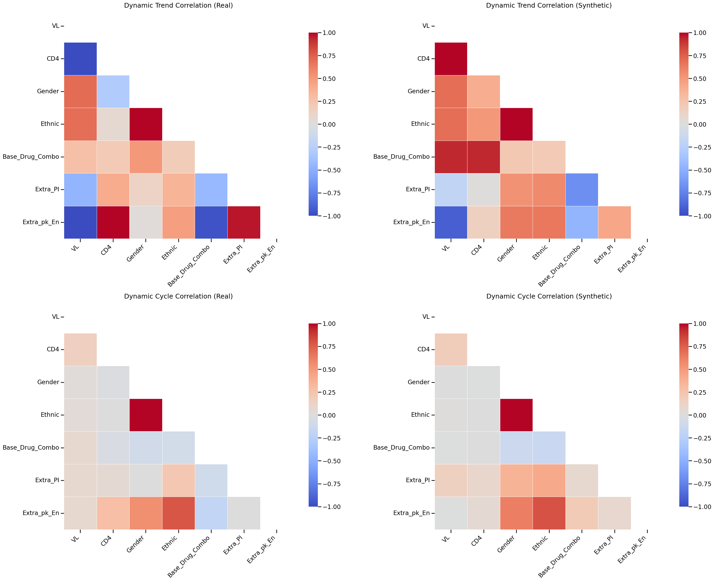

# Advanced Eyeballing -- Understanding Fidelity with Dynamic Correlations



Hey, hello, and Kia Ora!

Is your synthetic patient data reliable? Let's find out using dynamic correlations!

---

## Why static fidelity can mislead


<ins>Figure: Results from the DPM after 100 epochs of training.</ins>


<ins>Figure: Results from the DPM after 3000 epochs of training.</ins>

Consider these two marginal distribution comparisons, showing the ground truth vs those generated using the [DPM](https://github.com/NicKuo-ResearchStuff/Health_Gym_AI/tree/main/Blogs/Blogs006_HandsOn(HealthGymV3)). Both look fairly ok.</br>
However, while a model can match distributions at a single time, does it capture relationships among the feature variable above uni-variate level?


<ins>Figure: Results from the DPM after 100 epochs of training.</ins>


<ins>Figure: Results from the DPM after 3000 epochs of training.</ins>

hmm... while the correlations are not the strongest, we can still see a bit of resemblance.

Thus far, we have established that when a DPM, under the defaulted hyperparamters [here](https://github.com/NicKuo-ResearchStuff/Health_Gym_AI/blob/main/Blogs/Blogs006_HandsOn(HealthGymV3)/2025_10_23_HealthGymDiffusion_Example.ipynb) achieves
* reasonable marginal distribution, and
* still ok-ish correlation, we now question
can the DPM **capture long-run trajectories (trends) and short-run co-fluctuations (cycles)**.</br>
Remember, afterall, [the ART for HIV data is a longitudinal EMR](https://github.com/NicKuo-ResearchStuff/Health_Gym_AI/tree/main/Blogs/Blogs001_Intro), and that every patient has 60 time steps of data.
---

## The Dynamic Correlations


<ins>Figure: Results from the DPM after 100 epochs of training.</ins>

Ah 🤬🤬🤬🤬🤬, the data is 💩💩💩💩💩</br>


<ins>Figure: Results from the DPM after 3000 epochs of training.</ins>

Oh ok... 🤔🤔🤔🤔🤔</br>
things are getting better? What's underneath the hood?</br>
Again: all codes are provided in this folder, [check it out yourself](https://github.com/NicKuo-ResearchStuff/Health_Gym_AI/blob/main/Blogs/Blogs_Z_Implementation/Implementation27/2025_11_06_HgV3_Correlations_Epoch100.ipynb).

## Dynamic Correlations, Again
Most synthetic-data evaluations stop at static resemblance --</br>
*“Do the histograms overlap? Do the heatmaps look similar?”*
But longitudinal realism lives in the temporal grammar of the data --</br>
*how clinical variables move together through time.*
* From a AI/ML perspective, well-represented temporal data allows us to develop RL that maps action to outcomes in a sequence; and
* from a clinical perspective, correct temporal data allows us to compair the efficacy of different regimen combination.

By decomposing each variable $X_i(t)$ into:</br>
$X_i(t) = \text{Trend}_i(t) + \text{Cycle}_i(t)$</br>
and correlating both components within patients, we expose whether the DPM learned a bit of more causal information</br>
(yes I know... still controversial to claim)</br>
or is it just conducting momentary mimicry.

### Pseudocode

```markdown
for each dataset D in {real, syn}:
  for each patient k:
    for each variable pair (i, j):
      Xi, Xj = patient time-series
      Ti, Tj = Xi − detrend(Xi),  Xj − detrend(Xj)
      Ci, Cj = detrend(Xi),       detrend(Xj)
      rT = corr(Ti, Tj);  rC = corr(Ci, Cj)
      store rT, rC
  AvgTrend = FisherMean(all rT)
  AvgCycle = FisherMean(all rC)
```

---

## The Attached Code

Simple/static correlation is computed via

```
[1] Prepare → select matching columns; cast to float
[2] Compute → real_matrix = df_real.corr()
              fake_matrix = df_fake.corr()
[3] Plot    → two triangular heatmaps (Real | Synthetic), same scale [-1,+1]
```

whereas dynamic (trend/cycle) correlations are computed using

```
[1] Setup → assign PatientID/Timestep (for synthetic)
[2] Decompose → Cycle = detrend(X); Trend = X − Cycle
[3] Correlate → per patient, all variable pairs in Trend and Cycle
[4] Average  → Fisher z-mean across patients → two matrices
[5] Plot     → 2×2 heatmaps:
                Trend(Real|Syn)  +  Cycle(Real|Syn)
```

And note, even at 3000 epochs:

* Some drug features are over-coupled (residual batch echo).
* Cycles are under-energised -- diffusion hasn’t yet learned daily variability.
* Long-range trend coherence fades for long sequences.

These are healthy failures, indicating learning in progress.</br>
We encourage you to play with the code and try the following next steps:
1. Hyperparameter fine-tuning (β-schedules, reconstruction weights);
2. Longer training — diffusion learns slowly but faithfully; and
3. Dynamic metrics as early-stopping signals instead of loss curves.

---

## Wrapping Up

In this post, we discussed how static fidelity can fake realism; and for our longitudinal ART for HIV, it is helpful to probe the dynamic fidelity.</br>

Happy modelling,</br>
\-Nic

(Last Edit: 2025-11-06)
