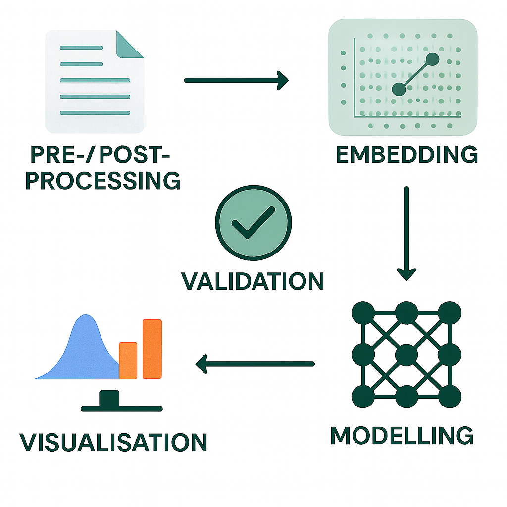

# Health Gym Implementation Series

Hey, hello, and Kia Ora!

Welcome to the Implementation Series of the Health Gym.  
This is where we roll up our sleeves and walk through step-by-step worked examples, showing exactly how to move from raw tables to model-ready data and embeddings, and how feature schemas and data loaders intertwine in practice.

If you’ve seen the Health Gym overview, you’ll know the big picture.  
Here, we zoom in to the nuts and bolts of how synthetic ART for HIV datasets are prepared and used.

---

## What is this series?

This series is created to help you understand the mechanics behind our worked examples.
* Each post is a Colab-friendly walkthrough with runnable code; and
* each step builds on the last, so you can follow sequentially or jump in where relevant.

---

## Posts in the Series

### [Implementation 01: Pre-processing the ART for HIV Dataset](https://github.com/NicKuo-ResearchStuff/Health_Gym_AI/tree/main/Blogs/Blogs_Z_Implementation/Implementation01)

A step-by-step walkthrough of the Health Gym ART for HIV dataset pre-processing pipeline, covering categorical mapping, Box–Cox normalisation, sanity checks, and preparing model-ready data.

---

### [Implementation 02: From Table to DataLoader](https://github.com/NicKuo-ResearchStuff/Health_Gym_AI/tree/main/Blogs/Blogs_Z_Implementation/Implementation02)

A step-by-step guide showing how to reshape the ART for HIV dataset into patient–timestep sequences, of shape `((-1, Cur_Len, Feats_Len))`.

---

### [Implementation 03: Embedding Features for ART for HIV](https://github.com/NicKuo-ResearchStuff/Health_Gym_AI/tree/main/Blogs/Blogs_Z_Implementation/Implementation03)

A walkthrough on `ARTFeatureEmbedding` to embed mixed clinical features of the ART for HIV dataset into dense vectors using PyTorch, preparing them for sequence models.

---

### [Implementation 04: Rethinking Feature Schema and Data Loading](https://github.com/NicKuo-ResearchStuff/Health_Gym_AI/tree/main/Blogs/Blogs_Z_Implementation/Implementation04)

A reflective blog post uncovering the "white lies" we told about reshaping and feature schemas, showing how data loading and embedding are in fact inseparably linked.

---

### [Implementation 05: Shuffling Feature Schema + DataLoader](https://github.com/NicKuo-ResearchStuff/Health_Gym_AI/tree/main/Blogs/Blogs_Z_Implementation/Implementation05)

This post shows how feature schema and DataLoader come together, with one-hot expansion handled cleanly inside a unified pipeline.

---

### [Implementation 06: Curriculum Learning with Nested DataLoaders](https://github.com/NicKuo-ResearchStuff/Health_Gym_AI/tree/main/Blogs/Blogs_Z_Implementation/Implementation06)

We build multiple DataLoaders of increasing sequence lengths and use them in curriculum style, so the WGAN trains from short to long horizons within each epoch.

---

### [Implementation 07: Health Gym v1: An LSTM-based WGAN](https://github.com/NicKuo-ResearchStuff/Health_Gym_AI/tree/main/Blogs/Blogs_Z_Implementation/Implementation07)

This post discusses how LSTM is embedded a GAN architecture to power the generation of realistic sequences of synthetic EHR time series.

---

### [Implementation 08: Health Gym v1: The Eye of the Critic, Part 1](https://github.com/NicKuo-ResearchStuff/Health_Gym_AI/tree/main/Blogs/Blogs_Z_Implementation/Implementation08)

This post dives into how the Health Gym v1 critic "rates realism" by scoring real data, fake data, and generator outputs during WGAN-GP training.

---

### [Implementation 09: Health Gym v1: The Eye of the Critic, Part 2](https://github.com/NicKuo-ResearchStuff/Health_Gym_AI/tree/main/Blogs/Blogs_Z_Implementation/Implementation09)

This post unpacks the critic’s roles in -- scoring interpolated real–fake sequences and applying the gradient penalty via input-space derivatives -- to enforce 1-Lipschitzness and stabilise training.

---

### [Implementation 10: Health Gym v1: One Does Not Simply Create Synthetic Data, Part 1](https://github.com/NicKuo-ResearchStuff/Health_Gym_AI/tree/main/Blogs/Blogs_Z_Implementation/Implementation10)

A walkthrough of how the Health Gym WGAN-GP generator transforms noise into schema-aware synthetic patient sequences that the critic uses to learn realism.

---

### [Implementation 11: Health Gym v1: One Does Not Simply Create Synthetic Data, Part 2](https://github.com/NicKuo-ResearchStuff/Health_Gym_AI/tree/main/Blogs/Blogs_Z_Implementation/Implementation11)

This post supplements blog 10 and discusses how the Health Gym generator learns from the critic’s feedback.

---

### [Implementation 12: Health Gym v1: The Learning Dynamics of GAN Sub-models](https://github.com/NicKuo-ResearchStuff/Health_Gym_AI/tree/main/Blogs/Blogs_Z_Implementation/Implementation12)

This post covers a visual exploration of how the Health Gym v1 WGAN-GP’s critic and generator gradually reach equilibrium—revealing smoother, more balanced learning dynamics across training epochs.

---

### [Implementation 13: Health Gym v1: Eyeballing the Results](https://github.com/NicKuo-ResearchStuff/Health_Gym_AI/tree/main/Blogs/Blogs_Z_Implementation/Implementation13)

This post covers the workflow for comparing real and synthetic data distributions in Health Gym v1, showing how to eyeball model realism after 100 epochs of WGAN-GP training.

---

### [Implementation 14: Health Gym v1: Health Gym v1: Train -> Save -> Load -> Train](https://github.com/NicKuo-ResearchStuff/Health_Gym_AI/tree/main/Blogs/Blogs_Z_Implementation/Implementation14)

This post provides a practical guide on how to pause, save, and resume WGAN-GP training.

---

### [Implementation 15: Health Gym v2: Tackling Mode Collapse with Memory](https://github.com/NicKuo-ResearchStuff/Health_Gym_AI/tree/main/Blogs/Blogs_Z_Implementation/Implementation15)

Health Gym v2 introduces a memory-augmented GAN that integrates a VAE and latent buffer to stabilise training, prevent mode collapse, and enhance the realism and diversity of synthetic clinical data.

---

### [Implementation 16: Health Gym v2: How the Latent Buffer Remembers](https://github.com/NicKuo-ResearchStuff/Health_Gym_AI/tree/main/Blogs/Blogs_Z_Implementation/Implementation16)

This post discusses the latent buffer that did most of the heavy-lifting for the memory-guided generation in Health Gym v2.

---

### [Implementation 17: Health Gym v2.5: Swapping the LSTM for a Transformer](https://github.com/NicKuo-ResearchStuff/Health_Gym_AI/tree/main/Blogs/Blogs_Z_Implementation/Implementation17)

Are transformers necessarily better than LSTMs? Let's discuss!

---

### [Implementation 18: When Synthetic Data Collapses, People Disappear](https://github.com/NicKuo-ResearchStuff/Health_Gym_AI/tree/main/Blogs/Blogs_Z_Implementation/Implementation18)

A discussion on the mode collapse issue on when synthetic data loses diversity, and why that disappearance matters for real patients.

---

### [Implementation 19: Health Gym v3: From Chaos to Clarity](https://github.com/NicKuo-ResearchStuff/Health_Gym_AI/tree/main/Blogs/Blogs_Z_Implementation/Implementation19)

A brief introduction on the paradigm shift from GANs to diffusion models, where a step-by-step process that learns to add and remove noise can turn chaos into clarity in synthetic health data generation.

---

### [Implementation 20: Health Gym v3: The Diffusion Pipeline](https://github.com/NicKuo-ResearchStuff/Health_Gym_AI/tree/main/Blogs/Blogs_Z_Implementation/Implementation20)

This post outlines some of the differences between the GAN-based pipeline and the Diffusion-based Pipeline.

---

### [Implementation 21: Health Gym v3: From Embeddings to Diffusion-Ready Tensors](https://github.com/NicKuo-ResearchStuff/Health_Gym_AI/tree/main/Blogs/Blogs_Z_Implementation/Implementation21)

A detaileed walkthrough of how Health Gym v3 transforms mixed clinical data into clean, reversible, and noise-compatible tensors.

---

### [Implementation 22: Health Gym v3: Forward Diffusion](https://github.com/NicKuo-ResearchStuff/Health_Gym_AI/tree/main/Blogs/Blogs_Z_Implementation/Implementation22)

A hands-on look at how Health Gym v3 manually defines forward diffusion to turn clean inputs into progressively noisy tensors via three key hyperparameters.

---

### [Implementation 23: Health Gym v3: Reverse Reconstruction](https://github.com/NicKuo-ResearchStuff/Health_Gym_AI/tree/main/Blogs/Blogs_Z_Implementation/Implementation23)

A quick look into how we reverse the diffusion process through step-by-step denoising.

---

### [Implementation 24: Health Gym v3: Inside the U-Net](https://github.com/NicKuo-ResearchStuff/Health_Gym_AI/tree/main/Blogs/Blogs_Z_Implementation/Implementation24)

An overview of the gadgets to be found in our Health Gym v3’s customised 1-D, time-conditioned U-Net.

---

### [Implementation 25: Health Gym v3: U-Net Sanity Checks](https://github.com/NicKuo-ResearchStuff/Health_Gym_AI/tree/main/Blogs/Blogs_Z_Implementation/Implementation25)

A visual and structural walkthrough discussing every temporal transformation in the U-Net.

---

### [Implementation 26: Health Gym v3: Engineering Guardrails for Correct Reconstruction](https://github.com/NicKuo-ResearchStuff/Health_Gym_AI/tree/main/Blogs/Blogs_Z_Implementation/Implementation26)

Ensures diffusion-generated clinical sequences remain numerically valid and decodable by filtering, rescaling, and reconstructing only those samples that stay within feasible bounds throughout denoising.

---

### [Implementation 27: Advanced Eyeballing -- Understanding Fidelity with Dynamic Correlations](https://github.com/NicKuo-ResearchStuff/Health_Gym_AI/tree/main/Blogs/Blogs_Z_Implementation/Implementation27)

Let's expose how synthetic data can look real but lie, and let's test the dynamic correlations of the data beyond static fidelity.

(Last Edit: 2025-11-06)

