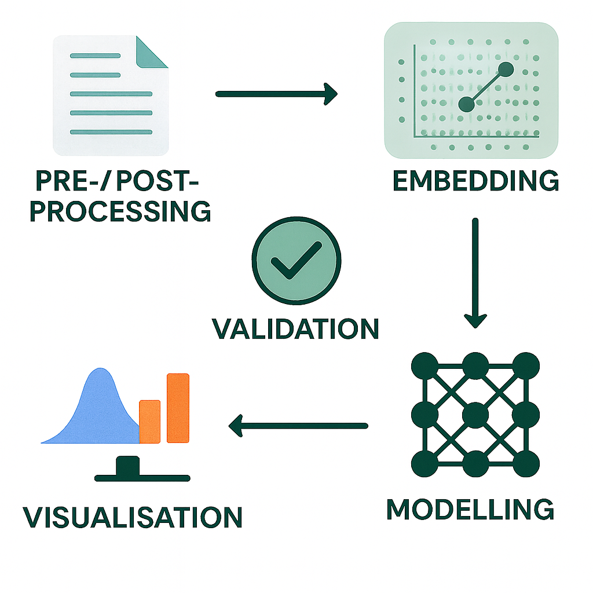

<!-- Logo and Branding -->

  

---

# About Health Gym

Health Gym [1] is a CBDRH initiative that releases privacy-preserving, realistic synthetic longitudinal EHR datasets and example codes so researchers, educators, and students can build and test models -- from predictive analytics to reinforcement learning -- without accessing identifiable patient data.

* What it provides: mixed-type time series (numeric, binary, categorical), teaching notebooks, and benchmarks for ML/RL, visualisation, survival analysis, and policy learning.
* How it’s built: state-of-the-art generative models (GANs[1, 2] and diffusion probabilistic models [3]) trained on curated cohorts; extensive realism, utility, and privacy evaluations.
* Datasets included:

  * Sepsis (from MIMIC-III [4, 5, 6])
  * Acute Hypotension (from MIMIC-III [4, 5, 6])
  * ART for HIV (from EuResist [7, 8])
* Why it’s safe: ethics approved (UNSW HC210661); rigorous disclosure-risk assessment; and non-identicality checks.
* Who it’s for: educators requiring data mimicking real world complexity [9], and researchers prototyping methods where access to real clinical data is restricted.

---

<!-- Side-by-side layout: text and illustration -->
<table>
<tr>
<td width="60%">

**Highlights of Health Gym**

* Open access: freely available synthetic health datasets and code.
* Safe to use: privacy-preserving, ethics-approved, and rigorously validated.
* Realistic complexity: mixed-type longitudinal data (numeric, binary, categorical).
* Education-ready: adopted in postgraduate courses & datathons at UNSW.
* Research-enabling: supports ML, survival analysis, and reinforcement learning on clinically relevant cohorts.

</td>
<td width="40%">
  
</td>
</tr>
</table>

---

<!-- Modelling Toolbox Illustration -->
<table>
<tr>
<td width="60%">

**Synthetic Data Generation Approaches**

* GANs: Adversarially trained recurrent networks that generate realistic longitudinal patient trajectories, validated for fidelity and privacy.
* Diffusion Models: Noise-based generative models that iteratively denoise to produce diverse, stable, and correlation-preserving synthetic health data.
* Hybrid Custom Model: A GAN extended with VAE encoding and replay buffers to mitigate mode collapse, ensuring fairer representation of minority groups and rare treatments.
* [Hands On with ART for HIV](https://github.com/NicKuo-ResearchStuff/Health_Gym_AI/tree/main/Blogs/Blogs001_Intro): 
  A friendly walkthrough on loading, preprocessing, and exploring the Health Gym ART for HIV synthetic dataset with Python.
* [Exploring the Realism of the ART for HIV Dataset](https://github.com/NicKuo-ResearchStuff/Health_Gym_AI/tree/main/Blogs/Blogs002_Realism): 
  A showcase of the ART for HIV dataset’s realism, using distribution plots, correlation checks, and downstream RL policy replication in treatment recommendations.
  
</td>
<td width="40%">
  
</td>
</tr>
</table>

---

<!-- Side-by-side layout: text and illustration -->
<table>
<tr>
<td width="60%">

**Worked Examples of the Models**

* [ART for HIV using the Health Gym v1 Model (WGAN-GP)](https://github.com/NicKuo-ResearchStuff/Health_Gym_AI/tree/main/Blogs/Blogs003_HandsOn(HealthGymV1)): 
  A hands-on walkthrough showing how the Health Gym v1 (WGAN-GP) can generate synthetic ART for HIV data, using a smaller subset to illustrate workflow, results, and progressive improvements with training.
* [ART for HIV using the Health Gym v2 Model (WGAN-GP + VAE + Buffer)](https://github.com/NicKuo-ResearchStuff/Health_Gym_AI/tree/main/Blogs/Blogs004_HandsOn(HealthGymV2)): 
  We introduce a meta-learner that guides the generator with a learned latent prior, enabling faster, more stable training and richer, more diverse synthetic ART for HIV data.
* [ART for HIV using the Health Gym v2.5 Model (WGAN-GP + 3EOT + VAE + Buffer)](https://github.com/NicKuo-ResearchStuff/Health_Gym_AI/tree/main/Blogs/Blogs005_HandsOn(HealthGymV2.5)): 
  A high-level walkthrough of Health Gym v2.5, showing how adding a Transformer generator to the v2 meta-learning framework improves realism, stability, and diversity in synthetic ART for HIV data.
  
</td>
<td width="40%">
  
</td>
</tr>
</table>

---

<!-- Side-by-side layout: text and illustration -->
<table>
<tr>
<td width="60%">

**Implementation Series**

* [Pre-processing the ART for HIV Dataset](https://github.com/NicKuo-ResearchStuff/Health_Gym_AI/tree/main/Blogs/Blogs_Z_Implementation/Implementation01): 
  A step-by-step walkthrough of the Health Gym ART for HIV dataset pre-processing pipeline, covering categorical mapping, Box–Cox normalisation, sanity checks, and preparing model-ready data.
* [From Table to DataLoader](https://github.com/NicKuo-ResearchStuff/Health_Gym_AI/tree/main/Blogs/Blogs_Z_Implementation/Implementation02): 
  A step-by-step guide showing how to reshape the ART for HIV dataset into patient–timestep sequences, of shape `((-1, Cur_Len, Feats_Len))`.
* [Embedding Features for ART for HIV](https://github.com/NicKuo-ResearchStuff/Health_Gym_AI/tree/main/Blogs/Blogs_Z_Implementation/Implementation03): 
  A walkthrough on `ARTFeatureEmbedding` to embed mixed clinical features of the ART for HIV dataset into dense vectors using PyTorch, preparing them for sequence models.  

</td>
<td width="40%">
  
</td>
</tr>
</table>

---

# Team

<table>
<tr>
<td align="center">
   
  <b>Dr. Nic Kuo (UNSW)</b>
</td>
<td align="center">
   
  <b>Prof. Mark Polizzotto (ANU)</b>
</td>
<td align="center">
   
  <b>Prof. Simon Finfer (UNSW)</b>
</td>
<td align="center">
   
  <b>A/Prof. Sebastiano Barbieri (UQ)</b>
</td>
<td align="center">
   
  <b>Prof-Director Louisa Jorm (UNSW)</b>
</td>
</tr>
</table>

---

<!-- CBDRH Branding -->

  

The Health Gym AI is a collection of research projects of the  
Centre for Big Data Research in Health (CBDRH), UNSW Sydney.  

- Concept created by: Sebastiano Barbieri & Louisa Jorm  
- Clinical domain expertise contributed by: Mark Polizzotto & Simon Finfer  
- Implementation: Nic Kuo  

For any questions or interest in collaboration, please reach out to Nic at [n.kuo@unsw.edu.au](mailto:n.kuo@unsw.edu.au)

---

# References
[1]: [Kuo et al., "The Health Gym: Synthetic Health-Related Datasets for the Development of Reinforcement Learning Algorithms." Scientific Data (2022).](https://www.nature.com/articles/s41597-022-01784-7)

[2]: [Kuo et al., "Generating Synthetic Clinical Data that Capture Class Imbalanced Distributions with Generative Adversarial Networks: Example using Antiretroviral Therapy for HIV." Journal of Biomedical Informatics (2023).](https://www.sciencedirect.com/science/article/pii/S1532046423001570)

[3]: [Kuo et al., "Synthetic Health-related Longitudinal Data with Mixed-type Variables Generated using Diffusion Models." NeurIPS Workshop on Synthetic Data Generation with Generative AI (2023).](https://openreview.net/forum?id=1MV49Ug6q9)

[4]: [Johnson et al., "MIMIC-III Clinical Database (version 1.4)." PhysioNet (2016).](https://doi.org/10.13026/C2XW26)

[5]: [Kuo et al., "Synthetic Acute Hypotension and Sepsis Datasets based on MIMIC-III and Published as Part of the Health Gym Project." arXiv preprint (2021).](https://arxiv.org/pdf/2112.03914)

[6]: [Kuo et al., "Synthetic Acute Hypotension and Sepsis Datasets Based on MIMIC-III and Published as Part of the Health Gym Project." PhysioNet (2022).](https://doi.org/10.13026/p0tv-0r98)

[7]: [Zazzi et al., "Predicting Response to Antiretroviral Treatment by Machine Learning: The EuResist Project." Intervirology (2012).](https://pubmed.ncbi.nlm.nih.gov/22286881/)

[8]: [Kuo, Nicholas. "The Health Gym v2.0 Synthetic Antiretroviral Therapy (ART) for HIV Dataset." Figshare (2023).](https://doi.org/10.6084/m9.figshare.22827878.v1)

[9]: [Kuo et al., "Enriching Data Science and Health Care Education: Application and Impact of Synthetic Data Sets through the Health Gym Project." JMIR Medical Education (2024).](https://mededu.jmir.org/2024/1/e51388/)

(Last Edit: 2025-09-26)
